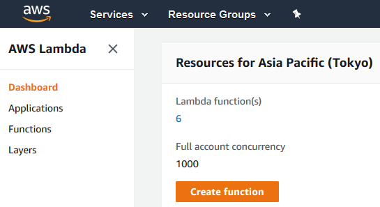
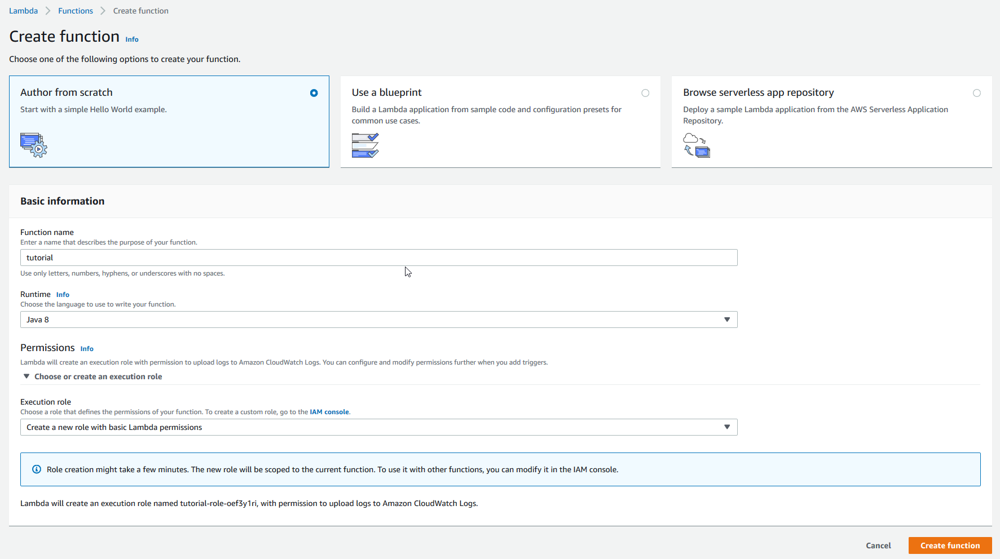
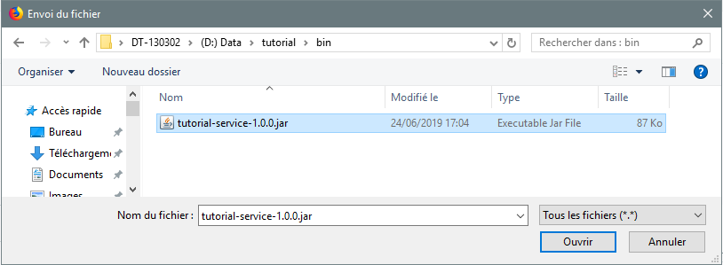
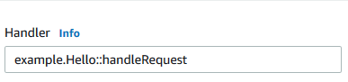
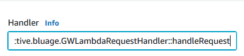
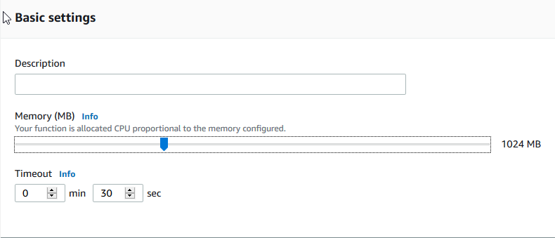

# BluAge Serverless COBOL for AWS - Setting up lambda functions

rev. 1.0.0 - (c) BluAge 2019

This guide will help you setting up AWS lambda functions when using the ServerLess COBOL solution. The content will be split in two parts:

 1. [Common configuration](#common-configuration)
 2. [Bespoke configuration by use case](#bespoke-configuration-by-use-case)

Following this guidelines will help you deploy the result of the Serverless COBOL sample compilations artifacts within minutes.

## Common configuration

### 1. Create and setup a new lambda function

Using the AWS Console, create a new Lambda function in one of the aws regions you've been given permission to use the ServerLess COBOL layer - click on the 'Create function' button:



Give it a meaningful name and select 'Java 8' as the Runtime to be used;

Regarding the role that will be used to execute the lambda, many options exist:

- creating a new role with specific authorizations for every lambda function you deploy;
- recycling existing role, whose authorizations fit the needs for the lambda function;

We recommend the first approach, as it permits to keep authorizations to the strict required mininum for the lambda function, having security concerns in mind.

Assuming that, pick 'Create a new role with basic Lambda permissions' for the Execution role:


Click on the 'Create function' button.

Extra configuration to be done on this fresh role will be explained in the [Bespoke configuration](#bespoke-configuration-by-use-case) part, as it will depend on the target use cases.

### 2. Lambda function: setting the BluAge ServerLess COBOL layer

  On the function editing page, click on the Layer zone to make the Layer management zone visible:


Click on the "Add a layer" button. A new page will appear. Select the option "Provide a layer version ARN". In the Layer version ARN textbox, paste the layer version ARN you have been granted use permission for that region.


&#x26A0; Depending on region, the version number and/or layer name may vary. The value on the screenshot above is just for illustration purpose, please use the version ARN provided by the BluAge helpdesk team.

Click on the 'Add' button to get back to the main lambda function UI page.

### 3. Lambda function settings

The main page exhibits an 'Unsaved changes' situation (and the layer counter value is now 1)


Since more settings need to be done, there's no need to save things right now.
Click on the function name, to make the standard Configuration visible again.
  
#### 3.1. Upload function code jar


Click on the 'Upload' button.
In the opening filepicker, select the jar file resulting of the compilation of your COBOL code and click on the 'Open' button (on this french screenshot, the 'Open' button is labelled 'Ouvrir').



The jar file now appears as selected:


#### 3.2. Set proper Handler

In the Handler textbox, replace the existing default value



by ```com.netfective.bluage.GWLambdaRequestHandler::handleRequest```



**The handler name is the same for every Serverless COBOL lambda function. It does not depend on the content of the compiled code.**

#### 3.3. Set memory limit and execution timeout

Scroll down the page to reach the Basic settings zone. Set the memory consumption to at least 1 GB and the Timeout to 30 seconds.



&#x26A0; Those settings are just some default recommended values that need to be finely tuned after having observed the first runs of the lambda. In particular, one might need to adjust the execution time limit for "long" running jobs and increase the amount off allocated memory. One remark: **the whole performance setup of the lambda function is governed by the sole memory slider**. Increasing the memory setting will also provide more CPU power (but of course, will increase the cost as well...). Our own tests strongly suggest to keep the memory setting above the 1024M threshold.

#### 3.4. The mandatory entry point environment variable

As the compiled COBOL code may contain several programs, the lambda function must be told which program has to be executed first (the run unit entry point). Therefore, a environment variable BA_RUN_UNIT_ENTRYPOINT has to be created and valuated. The value to be given is the ```PROGRAM ID``` (in the ```Idenfitication Division```) of the COBOL program to be executed first. If the ```PROGRAM ID``` is not specified, one can use the name of the file of the COBOL program (without any extension).

Example:

For

```{.cobol}
       Identification Division.
       Program-ID. GETENVS.
```

one should set


&#x26A0; If the BA_RUN_UNIT_ENTRYPOINT environment variable is missing or blank, the lambda function execution will fail, and print an error message like this one:


Now that all settings have been done, Scroll up the page and save all pending changes with the 'Save' button.

&#x26A0; Actual saving may take a few seconds as the effective jar code upload will take place at that time, and the upload time may vary depending on network conditions.

The settings have been saved, as indicated by the corresponding icon:


## Bespoke configuration by use case

### 1. Making use of the GETENVOP facility

The GETENVOP facility, described in the [Serverless COBOL AWS Extensions guide](./ServerLessCobolAWSExtensions.md), permits the COBOL code to get the environment variables values defined in the Lambda UI for the function.

Therefore, every time the COBOL code is expecting a value from an environment variable, the variable must be declared and valuated properly.

The environment variables are generally used to keep configuration details out of the code, allowing to change the name of a target resource (e.g. a SQS queue) without having to redeploy the code for a lambda function.

Illustration: if you take a look at the [SQS sample event driven sample](./cobol-samples/sqs-sample-event-driven/SQSSAMPLE.cbl), you will notice that the code is using two environment variables to identify the SQS queue to write messages to.

```{.cobol}
       01 sqs-queue-out-var-name PIC X(13) VALUE "SQS_OUT_QUEUE".
       01 sqs-region-var-name PIC X(14) VALUE "SQS_AWS_REGION".
      ...
      ...
      * GET VALUES FROM ENVIRONMENT VARIABLES: OUT QUEUE NAME AND REGION
        get-config-from-env.
           CALL "GETENVOP" using sqs-queue-out-var-name
                                 queue-name
                                 ge-op-result
           PERFORM check-ge-res
           CALL "GETENVOP" using sqs-region-var-name
                                 aws-region
                                 ge-op-result
           PERFORM check-ge-res
```

The corresponding environment variables must be defined accordingly in the lambda function UI, for the lambda execution to work properly:


&#x26A0; In that case, valuating the variables corresponds to pointing at a SQS queue named ```testlambdaout``` and located in the ```eu-central-1``` (aka Frankfurt) region. Depending on the COBOL code, the resource has to exist prior to the lambda function or not -- the COBOL code has the ability to create the resource if it does not exist: see the explainations about the [CREATEQ command](./ServerlessCobolAWSExtensions.md#the-createq-command) in the Serverless COBOL AWS Extensions to learn more about that.

### 2. Providing required access rights to the lambda function role

Using Serverless COBOL AWS Extensions, your COBOL code has the ability to interact with AWS services (S3, SQS, DynamoDB, Kinesis, ...). But accessing those resources is subject to authorizations that need to be given to the role used to execute the lambda function.

&#x26A0; **Disclaimer: This is inherent to the AWS environment itself: the same requirements apply if you write your own hand-coded lambda function: accessing AWS resources require permissions to be given**. The provided samples are here to help you get started quickly when deploying the Serverless COBOL samples to AWS Lambda; they are **NOT** necessarily meant to be considered as best practices. To go further, having production ready functions in mind, one should study carefully the arcanes of the [AWS Access Management](https://docs.aws.amazon.com/IAM/latest/UserGuide/access.html) and learn to create custom tailored policies.

&#x26A0; The ability to modify and grant permissions is itself depending on an AWS permission (a chicken-and-egg situation). All IAM actions described below need to be performed by an user granted to do so. In doubt, please contact your local AWS admin, so you can be granted the required permissions.

#### 2.1 A SQS use case

The following sections describe sample configuration actions to be accomplished for a lambda function that will interact with SQS queues.

##### 2.1.1 Identify SQS requirements

For example, let's consider the [SQS sample event driven sample](./cobol-samples/sqs-sample-event-driven/SQSSAMPLE.cbl). Looking at the code, we can identify that we both need to Receive and Send messages from/to SQS queues.

All SQSOP queue operations require the ```sqs:GetQueueUrl``` and ```sqs:GetQueueAttributes``` permissions to be given.

In addition to that, the Receive Messages (```sqs:ReceiveMessage```) permission requirement comes from the linkage section

```{.cobol}
       linkage section.
       01 msg-body.
        05 msg-body-len PIC 9(9) COMP-5.
        05 msg-body-data Pic X(32).
       procedure division using msg-body.
```

that indicates that the code is aimed at being triggered by a SQS event (the lambda function will be executed for any new message sent to a designated SQS queue -- see [SQS Event trigger support](./ServerlessCobolAWSExtensions.md#sqs-event-trigger-support) section of the Serverless COBOL AWS extensions programming guide for details).

The Send Message permission (```sqs:SendMessage```) requirement comes from the code itself:

```{.cobol}
           SET sqs-send-single-message TO TRUE
           CALL "SQSOP" using sqs-request-area
                              msg-body-fwd
                              sqs-op-result
```

The code is intended to send a message to a target queue, therefore Send Message permission has to be granted.

##### 2.1.2. Creating a new SQS queue to trigger the lambda

For the purpose of the sample, we need a SQS queue that will be used to trigger the lambda function execution.

Access the SQS administration UI, from the AWS console / Services menu:


There, click on the [Create New Queue] button:


Since the queue is intended to trigger the lambda function, it has to be a standard queue (not FIFO): triggering lambda from FIFO queue is not supported.

Give it a name that does not correspond to any existing queue for your account and the region - we chose ```testlambdain```


then click on the [Quick-Create Queue] button


The new queue is now displayed in the list of the existing queues for your account and region:


##### 2.1.3. Grant permission to receive/sent messages from/to queues

Modifying the permissions granted for a role is to be done in the IAM UI.

Access the IAM administration UI, from the AWS console / Services menu:


In the IAM UI, select the [Roles] entry on the left side menu:


In the roles list, click on the role that was created for the lambda function:


Looking at the summary for the role, we see that only the AWSLambdaBasicExecutionRole has been granted so far (at lambda function creation time):


Click on the [Attach Policies] button. A new screen appears.
You can either create a fully custom tailored policy, by clicking on the [Create policy] button. This part is beyond the scope of this documentation. Please refer to [https://docs.aws.amazon.com/IAM/latest/UserGuide/access_policies_create.html](https://docs.aws.amazon.com/IAM/latest/UserGuide/access_policies_create.html) for details on using this feature.

We chose to pick an existing policy, for the sake of simplicity.
In the search box, type SQS


Since we need both send and receive messages, we pick the AmazonSQSFullAccess permission policy (first entry), then click on the [Attach policy] button.

A confirmation message should appear, like the one below:


&#x26A0; In the case where the lambda is only receiving messages (and not sending any), selecting the predefined ```AWSLambdaSQSQueueExecutionRole``` policy is a better option. A fine grain custom made policy would surely inforce the permissions by restricting them to dedicated resources: please consult [https://docs.aws.amazon.com/AWSSimpleQueueService/latest/SQSDeveloperGuide/sqs-writing-an-sqs-policy.html](https://docs.aws.amazon.com/AWSSimpleQueueService/latest/SQSDeveloperGuide/sqs-writing-an-sqs-policy.html) for sample policies guidance.

##### 2.1.4. Using the new SQS queue to trigger the function

Once the queue has been created, we can use it to trigger the execution of the lambda function. Back to the lambda UI, click on the [+ Add trigger] button:


On the trigger page, select SQS in the dropdown list menu, then pick the freshly created queue, and click on the [Add] button:


If the role used to execute the lambda function is missing the ReceiveMessages permission, trying to add the trigger will fail and you will face an error message similar to this one:


At this point, all mandatory configuration actions to be able to run the [SQS sample event driven sample](./cobol-samples/sqs-sample-event-driven/SQSSAMPLE.cbl) are performed.

#### 2.2. A S3 use case

The following sections describe sample configuration actions to be accomplished for a lambda function that will interact with S3 buckets and objects.

##### 2.2.1 Identify S3 requirements

Let's take a look at the [S3 event driven sample](./cobol-samples/s3-sample-event-driven/S3TSAMPLE.cbl) COBOL program.

Since the linkage section is having a S3-Request-Area data structure,

```{.cobol}
       linkage section.
        01 s3-request-area.
           05 s3-handle PIC 9(9) COMP-5.  
           05 command PIC X(6).
              88 s3-open-file VALUE "OPEN  ".
              88 s3-read-file VALUE "READ  ".
              88 s3-close-file VALUE "CLOSE ".
              88 s3-delete-file VALUE "DELETE".
           05 s3-object-description.
              10 bucket-name PIC X(63).
              10 object-key PIC X(1024).
              10 region PIC X(24).
       procedure division using s3-request-area.
```

the lambda function is ready to be triggered by a S3 Event. But that does not require any additional configuration steps, as adding the S3 trigger will add the required permissions automatically.

Further looking at the code, we notice that the following object actions are involved during the code execution:

S3OP::OPEN

```{.cobol}
      *    OPEN S3 FILE
           SET s3-open-file TO TRUE
           CALL "S3OP" using s3-request-area s3-op-result
           PERFORM checks3-op-result
```

S3OP::CLOSE

```{.cobol}
      *    CLOSE S3 FILE
           SET s3-close-file TO TRUE
           call "S3OP" using s3-request-area s3-op-result
           PERFORM checks3-op-result
```

S3OP::DELETE

```{.cobol}
      *    DELETE
           SET s3-delete-file TO TRUE
           call "S3OP" using s3-request-area s3-op-result
```

- S3::OPEN requires the following permissions on the concerned bucket/objects:
```s3:ListBucket, s3:GetObject```
- S3::CLOSE does not require any permission.
- S3::DELETE requires the following permissions on the concerned bucket/objects:
```s3:ListBucket, s3:DeleteObject```

Therefore, the following policy template is enough to cover the required permissions for that function:

```{.json}
{
    "Version": "2012-10-17",
    "Statement": [
        {
            "Sid": "S3L",
            "Effect": "Allow",
            "Action": "s3:ListBucket",
            "Resource": "arn:aws:s3:::<bucket-name>"
        },
        {
            "Sid": "S3O",
            "Effect": "Allow",
            "Action": [
                "s3:GetObject",
                "s3:DeleteObject"
            ],
            "Resource": "arn:aws:s3:::<bucket-name>/*"
        }
    ]
}
```

Both bucket and object operations will be restricted to the dedicated bucket created above.

##### 2.2.2. Creating a new bucket to be used as a trigger source

For the S3 event driven sample, we suggest to create a dedicated S3 private bucket; the bucket **MUST** be located in the same region as the lambda function.

From the AWS console, select the S3 service in the Services menu:


There, click on the [+ Create Bucket] button:


Give it a name that is not already used in S3 and select the proper region. The requirement for uniqueness in bucket names can be tricky to complete. Adding a timestamp as a suffix to the name can help as it prevents from a lot of potential collisions.


You can click the [Next] button until you reach the page with the [Create bucket] button.


By default, S3 buckets are now created with restricted access permissions, preventing them from being publicly accessible.

Click on the [Create bucket] button.

The bucket will be created and will appear in the list of buckets:


##### 2.2.3. Using the new S3 bucket as trigger source

Now that the bucket has been created, we can use it to trigger the execution of the lambda function. Back to the lambda UI, click on the [+ Add trigger] button and select the S3 menu entry:


Pick the right bucket in the dropdown menu, and **be sure to select the ```PUT``` Event type as it is the sole supported event type by ServerLess COBOL for AWS for now.**

Click on the [Add] button.

A confirmation message will be printed in the lambda UI:


##### 2.2.4. Grant permission to get/delete objects from the target bucket

Once again, we use the IAM UI to modify the permissions for the lambda role.

Select the dedicated role for the lambda function and click on the [+ Add inline policy] button:


Select the JSON tab on the Create policy screen, and copy/paste the policy given in the section [2.2.1](#221-identify-s3-requirements) above replacing  ```<bucket name>``` with the the bucket name you have chosen (in my case: ```input-lambda-26072019```)


Click on the [Review policy] button.

Give the policy a name,


and click on the [Create policy] button.

The new policy can now be seen as attached to the lambda role:


You should now be able to execute the [S3 event driven sample](./cobol-samples/s3-sample-event-driven/S3TSAMPLE.cbl) function.

#### 2.3. A Kinesis use case

The following sections describe sample configuration actions to be accomplished for a lambda function that will interact with Kinesis data streams.

##### 2.3.1. Identify Kinesis requirements

Considering the example [kinesis-sample](./cobol-samples/kinesis-sample/Kinesis.cbl), we notice that the following actions are involved during the code execution:

KINESISOP::CREATE

```{.cobol}
     *     CREATE STREAM
           Set create-command to True
           Move "newStream" to stream-name
           Move 10 to shard-count
           Call "KINESISOP" Using kinesis-request-area kinesis-op-result
           Perform Check-kinesis-op-result
```

KINESISOP::PUBLISH

```{.cobol}
     *     PUBLISH
           Set publish-command to True
           Move "newStream" to stream-name
           Move "Hello" to kinesis-data
           Move "first" to partition-key
           Call "KINESISOP" Using kinesis-request-area kinesis-data
               kinesis-op-result
           Perform Check-kinesis-op-result
```

KINESISOP::READ

```{.cobol}
     *     READ
           Set read-command to True
           Move "first" to partition-key
           Call "KINESISOP" Using kinesis-request-area kinesis-data
               kinesis-op-result
           Perform Check-kinesis-op-result
           Display kinesis-data
```

KINESISOP::DELETE

```{.cobol}
     *     DELETE STREAM
           Set delete-command to True
           Move "newStreamToDelete" to stream-name
           Call "KINESISOP" Using kinesis-request-area kinesis-op-result
           Perform Check-kinesis-op-result
```

- KINESISOP::CREATE requires the following permissions on the concerned stream:
```kinesis:CreateStream, kinesis:DescribeStream```
- KINESISOP::PUBLISH requires the following permissions:
```kinesis:DescribeStream, kinesis:PutRecord```
- KINESISOP::READ requires: ```kinesis:GetShardIterator, kinesis:GetRecords```
- KINESISOP::DELETE finally requires the following permission:
```kinesis:DeleteStream```

Therefore, the following policy template is enough to cover the required permissions for that function:

```{.json}
{
    "Version": "2012-10-17",
    "Statement": [
        {
            "Sid": "Kinesis",
            "Effect": "Allow",
            "Action": [
                "kinesis:PutRecord",
                "kinesis:DeleteStream",
                "kinesis:CreateStream",
                "kinesis:GetShardIterator",
                "kinesis:GetRecords",
                "kinesis:DescribeStream"
            ],
            "Resource": "arn:aws:kinesis:<region>:<aws-account>:stream/*"
        }
    ]
}
```

Resource informations ```<region>, <aws-account>``` have to match the region you use and your aws account id.

##### 2.3.2. See the sample result on AWS Kinesis management console

From the AWS console, select the Kinesis service in the Services menu:


There, click on the [Data Streams] button after having tested the sample and observe that the stream "newStream" has been created according to the legacy sample. The second stream "newStreamToDelete" from the example has been already deleted.


#### 2.4. A DynamoDB use case

The following sections describe sample configuration actions to be accomplished for a lambda function that will interact with DynamoDB database.

##### 2.4.1. Identify DynamoDB requirements

[DynamoDB sample](./cobol-samples/dynamodb-sample/DynamoDB.cbl) executes the following actions in the COBOL code, requiring to set up some permissions:

DYNAMODB::STORE

```{.cobol}
     *     STORE
           Set store-command to True
           Move "telcoatom" to table-name
           Set number-key-type to True
           Set string-record-type to True
           Move "test" to dynamoDB-data
           Call "DYNAMODBOP" Using dynamoDB-request-area in-rec-as-str1
                dynamoDB-data dynamoDB-op-result
           Perform Checkdynamodb-op-result
```

DYNAMODB::READ

```{.cobol}
     *     READ
           Set read-command to True
           Set string-record-type to True
           Call "DYNAMODBOP" Using dynamoDB-request-area in-rec-as-str1
                dynamoDB-data dynamoDB-op-result
           Perform Checkdynamodb-op-result
           Display dynamoDB-data
```

DYNAMODB::UPDATE

```{.cobol}
     *     UPDATE
           Set update-command to True
           Set string-record-type to True
           Move "hello" to dynamoDB-data
           Call "DYNAMODBOP" Using dynamoDB-request-area in-rec-as-str1
                dynamoDB-data dynamoDB-op-result
           Perform Checkdynamodb-op-result

DYNAMODB::REMOVE

```{.cobol}
     *     REMOVE
           Set remove-command to True
           Call "DYNAMODBOP" Using dynamoDB-request-area in-rec-as-str2
                dynamoDB-op-result
           Perform Checkdynamodb-op-result
```

- DYNAMODB::STORE requires the following permission on the concerned database:
```dynamodb:PutItem```
- DYNAMODB::READ requires the following permission:
```dynamodb:GetItem```
- DYNAMODB::UPDATE requires: ```dynamodb:GetItem, dynamodb:UpdateItem```
- DYNAMODB::REMOVE finally requires the following permissions:
```dynamodb:GetItem, dynamodb:DeleteItem```

Therefore, the following policy template is enough to cover the required permissions for that function:

```{.json}
{
    "Version": "2012-10-17",
    "Statement": [
        {
            "Sid": "DDB",
            "Effect": "Allow",
            "Action": [
                "dynamodb:PutItem",
                "dynamodb:DeleteItem",
                "dynamodb:GetItem",
                "dynamodb:UpdateItem"
            ],
            "Resource": "arn:aws:dynamodb:<region>:<aws-account>:table/<table-name>"
        }
    ]
}
```

Resource informations ```<region>, <aws-account>, <table-name>``` have to match the region you use, your aws account id and the table name you have created for the sample (see [table creation section below](#242-creating-a-new-dynamodb-table-with-the-aws-console)).

Otherwise, the key necessary to store data in the database is in the linkage section of the COBOL code. Consequently, a test event has to be created to transmit values to the code and execute the operation.

In the Lambda function configuration interface, it is possible to configure test events in the top right corner as seen below :


Click on "Configure test events" button and create a new one as the example to set up number key type event.


##### 2.4.2. Creating a new DynamoDB table with the AWS console

Before testing dynamodb-sample, a dynamoDB table has to be created. From the AWS console, select the DynamoDB service in the Services menu:


In the DynamoDB dashboard, select the "Create table" button and create a new DynamoDB table as follows.


Thereafter, the sample can be tested and the result can be seen in the dynamoDB console in selecting the "Tables" section. Once the correct table is selected,click on "Items" and any record added by the lambda execution will be shown at for the key specified in the used test event.


