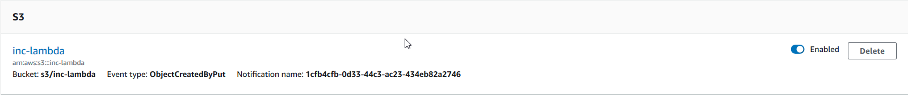
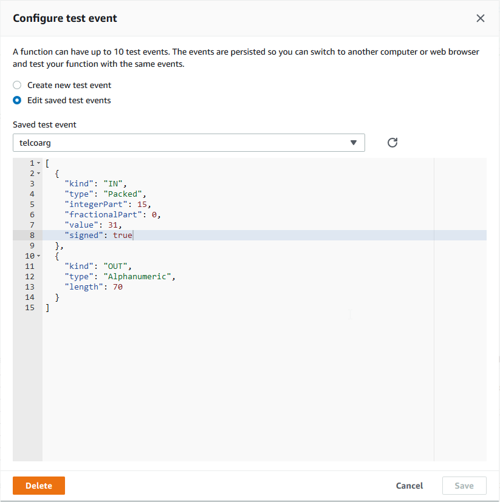

# BluAge Serverless COBOL Extensions for AWS - Programming Guide

rev. 1.0.5 - (c) BluAge 2019

In 2018, [BluAge](https://www.bluage.com) brought to the COBOL community the possiblity to compile their COBOL programs into artefacts that could be deployed and ran on AWS Serverless platform (kubernetes based/lambda), using the native Lambda java8 runtime.

Naturally, invoking COBOL code in an AWS lambda function raised the need for extensions, to permit :

* interacting with popular AWS services (S3, DynamoDB, Kinesis, SQS, ...)
* using lambda triggers (S3, DynamoDB, Kinesis, SQS, ...)

The following figure sums up what is currently supported by ServerLess COBOL AWS extensions, in terms of triggers and I/O for an AWS Lambda function.


The documentation below covers all API details about these extensions; the target audience is COBOL developpers, that are already familiar with AWS services semantics.
In particular, we make the assumption that the reader is already familiar with the usage of the targeted AWS services UI.

All extensions are part of the **BluAgeServerlessCOBOL** layer. Users need to be given access to this layer in order to be able to use the extensions. Please contact us using the page [BluAge Serverless COBOL](https://www.bluage.com/products/serverless-cobol) to be granted access to the layer usage.

## The FORCEABEND facility extension

One common point to all BluAge Serverless COBOL extensions for AWS is that they  use a numeric result status code to signal the outcome of invoked commands.

The documentation below will detail for each extension the meaning and severity (if it's an error) of each result status code. Some result status codes will indicate that a **severe** error occured during a command invokation. The COBOL program might then choose to terminate its execution flow abnormally and force the lambda run to signal a failed run.

In order to achieve this, BluAge introduced the FORCEABEND facility.

The FORCEABEND facility is a program present in the BluAge Serverless COBOL runtime that any COBOL program can call, using the following syntax:

```{.cobol}
    ...
          05 err-msg PIC X(23)
             VALUE "ERROR ON S3 OPERATION ".
    ...
          CALL "FORCEABEND" using err-msg
```

The err-msg parameter is an alphanumeric datastructure (size limit is the casual PIC X size limit) whose content will be logged at "FORCEABEND" invokation, to give some contextual information about what led to abnormal termination.

The err-msg parameter is optional but we strongly promote its usage.

What happens when the FORCEABEND facility is called?

A java.lang.IllegalStateException will be raised programmatically, that will force the lambda run to fail, along with logging the provided error message (for post-mortem investigations).

e.g.:

A severe error occurs while using the S3 extension: the lambda setup forgot to grant permission to access S3...
Trying to open the S3 object raised a severe error status code (**20**) that was handled by the COBOL code that decided to force abnormal termination:

```log
2019-04-11 16:06:41.587 ERROR 1 --- [ main] c.n.b.g.s.s.o.GenericS3Operations : S3 file [inc-lambda/sample.txt] could not be opened - reason : Access Denied (Service: S3, Status Code: 403, Request ID: E5B9E9F8932B095A)
2019-04-11 16:06:41.589 INFO 1 --- [ main] c.n.b.s.s.impl.S3sampleProcessImpl : ERROR ON S3 OPERATION: 20
...
2019-04-11 16:06:41.835 ERROR 1 --- [ main] c.n.b.g.f.a.support.ForceAbendPgmRunner : /!\ Forcing abend. Please inspect the logs to understand what went wrong./!\
2019-04-11 16:06:41.835 ERROR 1 --- [ main] c.n.b.g.f.a.support.ForceAbendPgmRunner : /!\ FORCE ABEND ERROR ON S3 OPERATION
...
2019-04-11 16:06:41.851 ERROR 1 --- [ main] c.n.bluage.GWLambdaRequestHandler : Exception occurred during lambda execution:

java.lang.IllegalStateException: FORCE ABEND ERROR ON S3 OPERATION
```

The "FORCEABEND" does not require any AWS permissions to be granted to the role executing the lambda function.

## The GETENVOP facility extension

Another common point to all Blu Age Serverless COBOL extensions for AWS is the use of a request area data structure to hold the infrastructure resources details (aws region, queue names/url, stream names, S3 bucket/ object names, etc...).

Having such configuration elements stuck in the code limits the flexibility of production management.

The GETENVOP facility extension gives the ability to provide configuration elements to the COBOL code through the usage of environment variables.

Production crew will be able to adapt the lambda function environment without having to recompile/redeploy the COBOL code.

The syntax for the "GETENVOP" call is

```{.cobol}
       CALL "GETENVOP" using <environment variable name holder>
                             <environment variable value holder>
                             <GETENVOP result status>
```

**All arguments are mandatory.**

The call to the "GETENVOP" facility program requires exactly 3 arguments:

* first argument is an alphanumeric field, holding the environment variable name to consult;
* second argument is an alphanumeric field, holding the returned environment variable value;
* third argument is a numeric indicator, between 0 and 20, being a result status indicating the outcome of the "GETENVOP" program.

   Possible values are:
  * **0**: OK STATUS  - the "GETENVOP" program successfully retrieved the value for the environment variable whose name was given and the environment variable value holder was large enough to hold this value.
  * **18**: OVERFLOW - the "GETENVOP" program successfully retrieved the value for the environment variable whose name was given but the environment variable value holder was **NOT** large enough to hold this value. The environment variable value holder is filled with the truncated environment variable value.
  * **19**: MISSING OR EMPTY VARIABLE - the "GETENVOP" was not able to retrieve an environment variable value for the given name. Either the envirnoment variable definition is missing or its value is empty. The environment variable holder is left untouched.
  * **20**: GENERAL ERROR - the "GETENVOP" program encountered an unexpected exception, preventing from being able to fulfill is duty. The environment variable holder is left untouched.

The COBOL code should **always** check the results status value and choose to ABEND the program execution when facing a fatal error situation.

Usage sample:

```{.cobol}
       Working-Storage Section.

       01 env-var-name PIC X(32) VALUE "BA_TEST_ENV_VARIABLE".
       01 env-var-value PIC X(32).
       01 ge-op-result  PIC 9(2) BINARY.

       ...
       procedure division.
       ...
       CALL "GETENVOP" using env-var-name env-var-value ge-op-result
       PERFORM check-ge-op-res.

       ...
      check-ge-op-res.
       IF ge-op-result >= 19 THEN
             MOVE ge-op-result TO ge-op-result-as-str
             DISPLAY ge-op-res-displ
             CALL "FORCEABEND" using ge-op-err-msg
       END-IF.
```

&#x26A0; Prior to using the "GETENVOP" facility, one should read [https://docs.aws.amazon.com/lambda/latest/dg/env_variables.html](https://docs.aws.amazon.com/lambda/latest/dg/env_variables.html), to know the rules and limits for the lambda environment variables.

The "GETENVOP" does not require any AWS permissions to be granted to the role executing the lambda function.

## The S3 Serverless COBOL extension

### Supported operations

Operations to manage buckets and the objects in buckets are both supported.

We focused on reading object operations for now: no writing operation is supported at the moment.

So far, supported S3 operations in the extension are:

* [CREATEB](#the-create-bucket-command) : create a S3 bucket;
* [DELETEB](#the-delete-bucket-command) : empty and delete a S3 bucket;
* [OPEN](#the-open-command) : open a S3 file for reading;
* [CLOSE](#the-close-command) : close a S3 file;
* [READ](#the-read-command): read a S3 file sequentially, into a fixed size record;
* [DELETE](#the-delete-command) : delete a S3 file;
* Support for one S3 object PUT trigger for a lambda function;

Current limitations on supported operations:

* Reading encrypted S3 objects is not supported yet.

### Lambda function setup

To be able to access desired S3 objects, the serverless COBOL lambda function must be granted permission(s) to do so.

Please see [https://docs.aws.amazon.com/lambda/latest/dg/with-s3.html](https://docs.aws.amazon.com/lambda/latest/dg/with-s3.html) for further details and the dedicated [section](#the-s3-operations-aws-permissions-requirements) in this document.

### API

All supported S3 operations rely on the "S3OP" program (part of the Serverless COBOL runtime) and the usage of a S3 Request Area data structure.

#### The S3 Request data structures

The calls to the "S3OP" program need two data structures. One to specify the information about the S3 object to be used know as the _s3 request area_, the other being a numeric to store the result status code of the S3 operations.

##### The s3 request area

This structure is designed to hold the S3 object required information for the program to access it.
The structure **must** match the following layout:

```{.cobol}
        01 s3-request-area.
            05 s3-handle PIC 9(9) COMP-5.  
            05 command PIC X(7).
                88 s3-create-bucket VALUE "CREATEB".
                88 s3-delete-bucket VALUE "DELETEB".
                88 s3-open-file VALUE "OPEN   ".
                88 s3-read-file VALUE "READ   ".
                88 s3-close-file VALUE "CLOSE  ".
                88 s3-delete-file VALUE "DELETE ".
            05 s3-object-description.
                10 bucket-name PIC X(63).
                10 object-key PIC X(1024).
                10 region PIC X(24).
            05 s3-object-privacy.
                10 block-public-acls PIC X(5) VALUE "FALSE".
                10 block-public-policy PIC X(5) VALUE "FALSE".
                10 ignore-public-acls PIC X(5) VALUE "FALSE".
                10 restrict-public-buckets PIC X(5) VALUE "FALSE".
```

Details on the elementary fields:

* ```s3-handle```: technical handle to identify the opened S3 object. This field should **never** be modified by the COBOL code. *It is reserved for the "S3OP" program internal use*.
* ```command```: the command to be executed by the "S3OP" program on the given S3 object. Level 88 entries with supported commands provided for the sake of error prevention.
* ```bucket-name```: must be valuated with the S3 Bucket name containing the object to be used;
* ```object-key```: must be valuated with the S3 Object key name containing the object to be used;
* ```region```: must be valuated with the name of the region in which the bucket is being located.
* ```block-public-acls```: setting this element to TRUE specifies that Amazon S3 should block public access control lists (ACLs) for this bucket and objects in this bucket.
* ```block-public-policy```: setting this element to TRUE specifies that Amazon S3 should block public bucket policies for this bucket.
* ```ignore-public-acls```: specifies whether Amazon S3 should ignore public ACLs for this bucket and objects in this bucket. Setting this element to TRUE causes Amazon S3 to create a private bucket.
* ```restrict-public-buckets```: specifies whether Amazon S3 should restrict public bucket policies for this bucket. Setting this element to TRUE restricts access to this bucket to only AWS services and authorized users within this account if the bucket has a public policy.

Any s3 request area data structure must be defined in the working-storage section unless you plan to get your code triggered in a lambda function by a S3 event.

**In that case, a single s3 request area has to be defined as the unique entry of the Linkage section. The procedure division must be defined as using this entry.**
See the related example program in the appendix for a complete S3 event triggered COBOL Lambda function code.

The content of the s3 request area within the linkage section will be automatically filled at run time by the informations gathered from the triggering S3 event.
Only an object PUT event is supported for now. Using any other kind of S3 event will result in a premature stop of the lambda function execution, with an error logged, as below:

```log
13:02:57.840 [main] ERROR com.netfective.bluage.GWLambdaRequestHandler - Exception occurred during lambda execution:
java.lang.IllegalStateException: Only S3 PUT Event is supported. Encountered ["ObjectCreated:Copy"]
```

##### The s3 operation result status holder

The "S3OP" program returns a numeric result status code on completion of each operation. This status code is a numeric integer value, between **0** and **20**.

All codes between **0** and **9** represent an operation result that should not lead the COBOL code to interrupt its execution flow. Codes over **10** shoud be treated as fatal errors and the COBOL code should handle this situation by interrupting its execution flow for most of the situations (using the "FORCEABEND" facility).

The sample COBOL programs in the appendix exhibit ways of handling the returned status codes.

The result status holder is a ```PIC 9(2) BINARY``` entry, that should be defined in the the working-storage section.

Typical definition:

```{.cobol}
01 s3-op-result  PIC 9(2) BINARY.
```

The status codes values, their meanings and scopes of application:

| Code | CREATEB | DELETEB | OPEN | CLOSE | DELETE | READ | Description |
|:---:|:---:|:---:|:---:|:---:|:---:|:---:|---|
| **0** | X | X | X | X | X | X | **Ok**|
| **1** |   |   | X |   |   |   | **Already open file**|
| **2** |   |   |   | X |   |   | **Closing non open file**|
| **3** |   |   |   |   |   | X | **Record not fulfilled**|
| **9** |   |   |   |   |   | X | **S3 object stream at end**|
| **10** |   |   | X |   |   |   |**Missing file**|
| **11** |   |   |   |   |   | X | **Attempt to read a non open file**|
| **12** |   | X | X |   | X |   | **Bucket does not exist**|
| **20** | X | X | X | X | X | X | **General I/O error**|

Meaning of each result status code:

* **Ok**: the command ran smoothly.
* **Already open file**: tried to open a S3 object that has already been opened.
* **Record not fulfilled**: a sequential read on a S3 object did not achieve to fulfill the given target record; this _could_ indicate that the S3 object is malformed or corrupted.
* **S3 object stream at end**: a sequential read on a S3 object reached the end of the stream.
* **Missing file**: no S3 object could be found using the provided S3 object information (bucket name/ object key / region).
* **Attempt to read a non open file**: an attempt to read sequentially a S3 object was made prior to opening it.
* **Bucket does not exist**: the bucket name given does not match with any bucket.
* **General I/O error**: all other errors that could arise during the operation, including issues with AWS access permissions to S3/Buckets/Objects.

Notes:

* a **9** result status is typically used to perform a sequential read loop on a S3 object, using a PERFORM UNTIL statement:

```{.cobol}
           MOVE "READ" TO command
           PERFORM ReadLoop UNTIL s3-op-result=9
           ...
           ReadLoop.
             call "S3OP" using s3-request-area in-rec s3-op-result
             ...
```

* a **20** status code will generally be related to some error logs that will help to diagnose what went wrong (typically: some bad lambda function setup).

e.g. : trying to invoke a lambda function that was not granted access to S3

```log
2019-04-11 16:06:39.016 INFO 1 --- [ main] c.n.b.g.s.support.S3OperationsPgmRunner : Command [OPEN] on object [inc-lambda | sample.txt] of region [eu-central-1]
2019-04-11 16:06:41.587 ERROR 1 --- [ main] c.n.b.g.s.s.o.GenericS3Operations : S3 file [inc-lambda/sample.txt] could not be opened - reason : Access Denied (Service: S3, Status Code: 403, Request ID: E5B9E9F8932B095A)
2019-04-11 16:06:41.589 INFO 1 --- [ main] c.n.b.s.s.impl.S3sampleProcessImpl : ERROR ON S3 OPERATION: 20
```

#### The s3 operations AWS permissions requirements

Below are detailed, on a per operation basis, the AWS permissions requirements, as declared in the JSON AWS policies. The role used to execute the lambda fuction will have to be granted these permissions in order to ensure proper code execution.

Please consult [the official AWS S3 permissions documentation](https://docs.aws.amazon.com/AmazonS3/latest/dev/using-with-s3-actions.html); In particular, the details about the scope on which the permissions listed below apply (Object, Bucket, etc...).

| Function | Required Permissions |
|:---:|:---:|
| OPEN | ```s3:ListBucket, s3:GetObject```  |
| READ | - |
| CLOSE | - |
| DELETE| ```s3:ListBucket, s3:DeleteObject```  |
| CREATEB | ```s3:CreateBucket, s3:PutBucketPublicAccessBlock``` |
| DELETEB | ```s3:ListBucket, s3:DeleteObject, s3:ListBucketVersions, s3:DeleteBucket``` |

In addition to these explicit calls, if the COBOL code is to be triggered by a S3 PUT operation, please consult the [official 'Using AWS Lambda with Amazon S3' documentation](https://docs.aws.amazon.com/lambda/latest/dg/with-s3.html) for directions on configuring the lambda execution role.


#### The "S3OP" call details

Calling the "S3OP" program rely on the following syntax:

READ command:

```{.cobol}
CALL "S3OP" using s3-request-area <record to read into> s3-op-result
```

Other commands:

```{.cobol}
CALL "S3OP" using s3-request-area s3-op-result
```

The status result code will be stored in the s3-op-result data structure after command completion.

##### The "CREATEB" command

Create a new S3 bucket.

```{.cobol}
      *    CREATE S3 PUBLIC BUCKET
           SET s3-create-bucket TO TRUE
           CALL "S3OP" using s3-request-area s3-op-result
           PERFORM checks3-op-result

      *    CREATE S3 PRIVATE BUCKET
           MOVE "TRUE " to block-public-acls
           MOVE "TRUE " to block-public-policy
           MOVE "TRUE " to ignore-public-acls
           MOVE "TRUE " to restrict-public-buckets
           CALL "S3OP" using s3-request-area s3-op-result
           PERFORM checks3-op-result
```

If command execution completed successfully, the **0** result status code will be set.
If any other I/O error occurs while trying to create the S3 bucket, the **20** result status code will be set.

Notes:

* The name of every bucket is unique on an Amazon account so the bucket will be created with a name containing timestamped informations.
* All access parameters in the s3-object-privacy section of the s3-request-area are set to FALSE by default, so a public access bucket is created by default.
* To obtain a totally private bucket, the property ```ignore-public-acls``` have to be set to TRUE.

##### The "DELETEB" command

Empty and delete an existing S3 bucket.

```{.cobol}
      *    DELETE S3 BUCKET
           SET s3-delete-bucket TO TRUE
           CALL "S3OP" using s3-request-area s3-op-result
           PERFORM checks3-op-result
```

Possible outcomes from the "OPEN" command:

* If command execution completed successfully, the **0** result status code will be set.
* The given bucket name information did not permit to find any existing S3 bucket. No bucket is deleted and the result status code is set to **12**. The COBOL program should handle this as a severe error.
* If any other I/O error occurs while trying to create the S3 bucket, the **20** result status code will be set.

Note:

* The command delete previously all objects contained in the bucket, then if the bucket is versioned, all versions are deleted. And finally the bucket itself is deleted.

##### The "OPEN" command

The purpose of the "OPEN" command is to open a stream for **reading** the S3 object defined by the S3 request area.

```{.cobol}
      *    OPEN S3 FILE
           Move "OPEN" to command
           CALL "S3OP" using s3-request-area s3-op-result
```

Possible outcomes from the "OPEN" command:

* The "S3OP" program succeded in opening a stream for reading the designated S3 object. The result status code is set to **0**.
* The COBOL client code asked to the "S3OP" program to open a stream for reading the designated S3 object but a previously "OPEN" command has already done this. This is a no-op: no extra stream will be opened, but the result status code will set to **1**. This generally indicates a misconception in the COBOL program logic (doing two successive "OPEN").
* The given S3 identification information did not permit to locate any existing S3 object. No stream is opened and the result status code is set to **10**. The COBOL program should handle this as a severe error.
* The given bucket name did not permit to find any existing S3 bucket. No stream is opened and the result status code is set to **12**. The COBOL program should handle this as a severe error.
* The "S3OP" did not achieve to open a stream do the designated S3 object. No stream is open and the the result status code is set to **20**. The COBOL program should handle this as a severe error.
This situation might arise for several different reasons:
  * Technical issue with the S3 service;
  * Permission issue to access the S3 Object for the role used by the lambda function;

Notes:

* Before trying to read a S3 object, one must open it. The "READ" command below does **not** do an implicit "OPEN".
* You should not open a stream on a S3 object before invoking a "DELETE" command on it, without closing it before.

##### The "READ" command

Once a stream on a S3 object has been created by the "OPEN" command, one can read it sequentially using the "READ" command.
The sequential read generally involves a read loop that fully read the file from the start to the end (signaled by the result status code **9**).

The "S3OP" program will try to read as many bytes from the stream as the provided record (the second parameter of the call) can store. If the program fails to fulfill the record, a result status code **3** will be set.

Typical full read example:

```{.cobol}
       Working-Storage Section.

       01 in-rec PIC S9(15) Packed-Decimal.
       01 s3-op-result  PIC 9(2) BINARY.
       01 s3-op-res-displ.
          05 s3-op-err-msg PIC X(22)
             VALUE "ERROR ON S3 OPERATION ".
          05 s3-op-result-as-str PIC X(2).
       ...
       procedure division
       ...
           MOVE "READ" TO command
           PERFORM ReadLoop UNTIL s3-op-result=9
       ...
          ReadLoop.
           call "S3OP" using s3-request-area in-rec s3-op-result
           PERFORM Check-s3-op-result
      ...
        Check-s3-op-result.
           IF s3-op-result >= 10 THEN
             MOVE s3-op-result TO s3-op-result-as-str
             DISPLAY s3-op-res-displ
             CALL "FORCEABEND" using s3-op-err-msg
           END-IF.

```

In this example, the target record is 8 bytes long (```PIC S9(15) Packed-Decimal```). Each call to the command "READ" will try to read 8 bytes from the S3 stream.

After each read, the code checks the result status code, using the ```Check-s3-op-result``` paragraph, to ensure no severe error has been signaled. If a severe error occurs, the program is terminated abnormally, using the "FORCEABEND" facility.

##### The "CLOSE" command

Once all required reads have been made from a S3 object, one can close the object stream through the "CLOSE" command.

```{.cobol}
      *    CLOSE S3 FILE
           Move "CLOSE" to command
           CALL "S3OP" using s3-request-area s3-op-result
```

If command execution completed successfully, the **0** result status code will be set. If a "CLOSE" is called on an object that has not been previously opened, the command is a no-op and the **2** result status code is set; this generally indicates a misconception in the COBOL program logic (closing before opening).

If any other I/O error occurs while trying to close the S3 object stream, the **20** result status code will be set.

##### The "DELETE" command

Delete an existing S3 object from its owning bucket.

```{.cobol}
      *    DELETE S3 FILE
           Move "DELETE" to command
           CALL "S3OP" using s3-request-area s3-op-result
```

Notes:

* If the provided S3 object identification (object key / region) does not correspond to any existing S3 object, the "DELETE" operation will be a silent no-op (and will set the result status to **0**).
* Unless the bucket name given does not match any existing bucket, then the result status code is set to **12**. The COBOL program should handle this as a severe error.

#### S3 triggered ServerLessCOBOL full sample program

ServerLessCOBOL supports triggering a Lambda function with a S3 put operation: the lambda function will be launched every time a file is put to a determined S3 bucket.

The compiled code will automatically feed the S3 request area (argument of the linkage section) with the information about the file that has been put to the S3 bucket, allowing the COBOL code to manipulate the file using the "S3OP" program.

##### Sample program code

The following program will:

* open the S3 file that triggered the lambda function, by being put to a S3 bucket;
* reads the S3 file fully and display the content of each record; each record is a 32 characters long string;
* close and delete the S3 file.

```{.cobol}
       Identification Division.
       Program-ID. S3TSAMPLE.
      ******************************************************************
      *  BLU AGE SERVERLESS COBOL - AWS S3  EXTENSION - SAMPLE PROGRAM  
      *  OBJECT: DEMONSTRATING S3 EVENT DRIVEN LAMBDA FUNCTION
      *  - OPEN FILE
      *  - READ FILE
      *  - CLOSE FILE
      *  - DELETE FILE
      *  (C) BLU AGE 2019 - ALL RIGHTS RESERVED
      ******************************************************************
       Environment Division.
       Input-Output Section.

       Data Division.
       Working-Storage Section.

       01  in-rec PIC X(32).

       01 s3-op-result  PIC 9(2) BINARY.

       01 s3-op-res-displ.
          05 s3-op-err-msg PIC X(23)
             VALUE "ERROR ON S3 OPERATION: ".
          05 s3-op-result-as-str PIC X(2).

       linkage section.
        01 s3-request-area.
           05 s3-handle PIC 9(9) COMP-5.  
           05 command PIC X(6).
              88 s3-open-file VALUE "OPEN  ".
              88 s3-read-file VALUE "READ  ".
              88 s3-close-file VALUE "CLOSE ".
              88 s3-delete-file VALUE "DELETE".
           05 s3-object-description.
              10 bucket-name PIC X(63).
              10 object-key PIC X(1024).
              10 region PIC X(24).


       procedure division using s3-request-area.

       Main.
      *    OPEN S3 FILE
           SET s3-open-file TO TRUE
           CALL "S3OP" using s3-request-area s3-op-result
           PERFORM checks3-op-result

      *    READ LOOP
           SET s3-read-file TO TRUE
           PERFORM read-loop UNTIL s3-op-result=9

      *    CLOSE S3 FILE
           SET s3-close-file TO TRUE
           call "S3OP" using s3-request-area s3-op-result
           PERFORM checks3-op-result

      *    DELETE
           SET s3-delete-file TO TRUE
           call "S3OP" using s3-request-area s3-op-result
           PERFORM checks3-op-result
           DISPLAY "NORMAL END OF EXECUTION."
           GOBACK.

        read-loop.
           call "S3OP" using s3-request-area in-rec s3-op-result
           PERFORM checks3-op-result
           DISPLAY in-rec
           .

      *   CHECK S3 OPERATION OUTCOME
        checks3-op-result.
           IF s3-op-result >= 10 THEN 
             MOVE s3-op-result TO s3-op-result-as-str
             DISPLAY s3-op-res-displ
             CALL "FORCEABEND" using s3-op-err-msg 
           END-IF.

```

##### Deploying / Testing the program

We use a Lambda function name "S3EventDriven" to illustrate the sample above.

Once the preliminary setup of the function has been made (uploading compiled code jar, setup request handler, setup memory and execution time out, setup program entry point using the BA_RUN_UNIT_ENTRYPOINT environment variable, setup ServerLessCOBOL layer), add a S3 trigger to th S3EventDriven lambda function, pointing at Object **PUT** events occuring on the S3 bucket named "inc-lambda"

  

Click on the "Add" button.

&#x26A0; Only **PUT** S3 events are currently supported by ServerLessCOBOL. Picking another kind of event will end up with the lambda function execution early failing.

Don't forget to "Save" using the dedicated button up in Lambda UI.
Once saved, the S3 trigger is active



Sample data file to upload: craft an ANSI encoded sample data file containing alphanumeric records, each record being 32 characters long.

We use the MOVIES.txt data file four this purpose, that contains 10 film titles, all padded with spaces to 32 characters.
You can create this sample data file by copy/pasting the content below into an ANSI encoded text file named MOVIES.txt (make sure to include the trailing spaces)

<pre>
The Phantom of the Opera        The Pirates of Penzance         Prisoners of the Lost Universe  The Right Stuff                 Los viajes de Gulliver          Thieves After Dark              WarGames                        Crazy Like a Fox                Les sentiers de la gloire       The Hello Goodbye Man           
</pre>

Upload this file to the target S3 bucket used in the S3 trigger:


Click on the 'Upload' button.


Uploading the file has triggered the run of the S3EventDriven Lambda function. Inspecting the CloudWatch logs for the function confirm that the function proceeded normally:

```log
...
2019-05-16 12:47:46.863 INFO 1 --- [ main] c.n.b.g.s.support.S3OperationsPgmRunner : Command [OPEN] on object [inc-lambda/MOVIES.txt] of region [eu-central-1]
2019-05-16 12:47:46.884 INFO 1 --- [ main] c.n.b.g.s.s.o.AbstractS3Operations : Using new handle {1} for S3 object [inc-lambda/MOVIES.txt]
2019-05-16 12:47:46.953 INFO 1 --- [ main] c.n.b.g.s.s.o.GenericS3Operations : Successfully opened S3 file [inc-lambda/MOVIES.txt]
2019-05-16 12:47:46.954 INFO 1 --- [ main] c.n.b.s.s.impl.S3tsampleProcessImpl : The Phantom of the Opera
2019-05-16 12:47:46.954 INFO 1 --- [ main] c.n.b.s.s.impl.S3tsampleProcessImpl : The Pirates of Penzance
2019-05-16 12:47:46.954 INFO 1 --- [ main] c.n.b.s.s.impl.S3tsampleProcessImpl : Prisoners of the Lost Universe
2019-05-16 12:47:46.955 INFO 1 --- [ main] c.n.b.s.s.impl.S3tsampleProcessImpl : The Right Stuff
2019-05-16 12:47:46.955 INFO 1 --- [ main] c.n.b.s.s.impl.S3tsampleProcessImpl : Los viajes de Gulliver
2019-05-16 12:47:46.955 INFO 1 --- [ main] c.n.b.s.s.impl.S3tsampleProcessImpl : Thieves After Dark
2019-05-16 12:47:46.955 INFO 1 --- [ main] c.n.b.s.s.impl.S3tsampleProcessImpl : WarGames
2019-05-16 12:47:46.955 INFO 1 --- [ main] c.n.b.s.s.impl.S3tsampleProcessImpl : Crazy Like a Fox
2019-05-16 12:47:46.955 INFO 1 --- [ main] c.n.b.s.s.impl.S3tsampleProcessImpl : Les sentiers de la gloire
2019-05-16 12:47:46.956 INFO 1 --- [ main] c.n.b.s.s.impl.S3tsampleProcessImpl : The Hello Goodbye Man
2019-05-16 12:47:46.956 WARN 1 --- [ main] c.n.b.g.s.s.operations.ReadS3Operations : S3 Read [inc-lambda]: EOF
2019-05-16 12:47:46.956 INFO 1 --- [ main] c.n.b.s.s.impl.S3tsampleProcessImpl : The Hello Goodbye Man
2019-05-16 12:47:46.956 INFO 1 --- [ main] c.n.b.g.s.support.S3OperationsPgmRunner : Command [CLOSE] on object [inc-lambda/MOVIES.txt] of region [eu-central-1]
2019-05-16 12:47:46.956 INFO 1 --- [ main] c.n.b.g.s.s.o.GenericS3Operations : Successfully closed S3 file [inc-lambda/MOVIES.txt]
2019-05-16 12:47:46.956 INFO 1 --- [ main] c.n.b.g.s.support.S3OperationsPgmRunner : Command [DELETE] on object [inc-lambda/MOVIES.txt] of region [eu-central-1]
2019-05-16 12:47:46.989 INFO 1 --- [ main] c.n.b.s.s.impl.S3tsampleProcessImpl : NORMAL END OF EXECUTION.
2019-05-16 12:47:46.989 INFO 1 --- [ main] c.n.b.g.rt.db.stats.DatabaseStatistics : DATABASE STATISTIC DISABLED
2019-05-16 12:47:46.989 INFO 1 --- [ main] c.netfective.bluage.SpringBootLauncher : Done. (143 ms)
2019-05-16 12:47:46.991 INFO 1 --- [ main] c.n.bluage.GWLambdaRequestHandler : Handling request took 149 ms
END RequestId: 834b0872-26d3-4f00-b107-564f661a6e83
REPORT RequestId: 834b0872-26d3-4f00-b107-564f661a6e83 Duration: 150.23 ms Billed Duration: 200 ms Memory Size: 1536 MB Max Memory Used: 260 MB 
```

Refreshing the S3 UI will show that the MOVIES.txt file has been deleted from its bucket.

## The DynamoDB Serverless COBOL extension

### Supported operations

So far, supported DynamoDB operations in the extension are:

* [STORE](#the-store-command) : store a new entry in DynamoDB;
* [UPDATE](#the-update-command) : update an entry in DynamoDB;
* [READ](#the-read-command-1): read an entry in DynamoDB;
* [REMOVE](#the-remove-command) : remove an entry in DynamoDB;

### Lambda function setup

To be able to manage resources related to your DynamoDB Streams stream, the serverless COBOL lambda function must be granted permission(s) to do so.

Please see [https://docs.aws.amazon.com/lambda/latest/dg/with-ddb.html](https://docs.aws.amazon.com/lambda/latest/dg/with-ddb.html) for further details and the dedicated [section](#the-dynamodb-operations-aws-permissions-requirements) in this document.

### API

All supported DynamoDB operations rely on the "DYNAMODB" program (part of the Serverless COBOL runtime) and the usage of a DynamoDB Request Area data structure.

#### The DynamoDB Request data structures

The calls to the "DYNAMODB" program need two data structures. One to specify the information about the DynamoDB request to be performed know as the _DynamoDB-request-area_, the other being a numeric to store the result status code of the DynamoDB operations.

##### The DynamoDB request area

This structure is designed to hold the DynamoDB request required information for the program to process it.
The structure **must** match the following layout:

```{.cobol}
        01  DynamoDB-request-area.
           05 command PIC X(6).
             88 store-command value 'STORE'.
             88 update-command value 'UPDATE'.
             88 read-command value 'READ'.
             88 remove-command value 'REMOVE'.
           05 aws-region PIC X(24).
           05 table-name PIC X(255).
           05 key-type PIC X(2).
             88 binary-key-type value 'B'.
             88 string-key-type value 'S'.
             88 number-key-type value 'N'.
             88 boolean-key-type value 'BO'.
             88 string-set-key-type value 'SS'.
             88 binary-set-key-type value 'BS'.
             88 number-set-key-type value 'NS'.
           05 record-type PIC X(2).
             88 binary-record-type value 'B'.
             88 string-record-type value 'S'.
             88 number-record-type value 'N'.
             88 boolean-record-type value 'BO'.
             88 string-set-record-type value 'SS'.
             88 binary-set-record-type value 'BS'.
             88 number-set-record-type value 'NS'.
```

Details on the elementary fields:

* ```command```: the command to be executed by the "DYNAMODB" program on the given DynamoDB database;
* ```aws-region```: must be valuated with the name of the region in which the bucket is being located;
* ```table-name```: must be valuated with the DynamoDB table name to be accessed;
* ```key-type```: must be valuated with the key type to be used by the database;
* ```record-type```: must be valuated with the record type to be used by the database.

The DynamoDBRequestArea is stored in the copybook DynamoDBRQA.cpy.

Any DynamoDB request area data structure must be defined in the working-storage section unless you plan to get your code triggered in a lambda function by a DynamoDB event.

<!---**In that case, a single DynamoDB request area has to be defined as the unique entry of the Linkage section. The procedure division must be defined as using this entry.**
See the related example program in the appendix for a complete DynamoDB event triggered COBOL Lambda function code.

The content of the DynamoDB request area within the linkage section will be automatically filled at run time by the informations gathered from the triggering DynamoDB event.--->

##### The DynamoDB operation result status holder

The "DYNAMODB" program returns a numeric result status code on completion of each operation. This status code is a numeric integer value, between **0** and **20**.

All codes between **0** and **9** represent an operation result that should not lead the COBOL code to interrupt its execution flow. Codes over **10** shoud be treated as fatal errors and the COBOL code should handle this situation by interrupting its execution flow for most of the situations.

Note that the "DYNAMODB" won't break the lambda execution flow when encoutering errors by itself.
**The calling COBOL code has to handle the returned status codes properly and take decisions about its execution flow.**

The sample COBOL programs in the appendix exhibit ways of handling the returned status codes.

The result status holder is a ```PIC 9(2) BINARY``` entry, that should be defined in the working-storage section;

Typical definition:

```{.cobol}
01  DynamoDB-result-status PIC 9(2) BINARY.
```

The status codes values, their short description and scopes of application:

| Code | STORE | UPDATE | READ | REMOVE | Description |
|:---:|:---:|:---:|:---:|:---:|---|
| **0** | X | X | X | X | **Ok**|
| **1** |   | X | X | X | **No item found**|
| **2** | X | X | X | X |**Empty table name**|
| **3** |   |   |   |   | **Unsupported command**|
| **4** | X | X | X | X | **Unsupported type conversion**|
| **18** | X | X | X | X | **Invalid region**|
| **20** | X | X | X | X | **I/O error status**|

Meaning of each result status code:

* **Ok**: the command ran smoothly.
* **No item found**: no item matches with the given key.
* **Empty table name**: the table name is empty.
* **Unsupported command**: the command name is not supported.
* **Unsupported type conversion**: the type defined is not supported.
* **Invalid region**: an invalid region identifier has been provided. The current DynamoDB operation won't proceed. Fix the typo in the COBOL before trying to run the program again.
* **I/O error status**: all other errors that could arise during the operation, including issues with AWS access permissions.

#### The DynamoDB operations AWS permissions requirements

Below are detailed, on a per operation basis, the AWS permissions requirements, as declared in the JSON AWS policies. The role used to execute the lambda fuction will have to be granted these permissions in order to ensure proper code execution.

Please consult [the official AWS DynamoDB permissions documentation](https://docs.aws.amazon.com/amazondynamodb/latest/developerguide/api-permissions-reference.html).

| Function | Required Permissions |
|:---:|:---:|
| STORE | ```dynamodb:PutItem```  |
| UPDATE | ```dynamodb:GetItem, dynamodb:UpdateItem```|
| READ | ```dynamodb:GetItem``` |
| REMOVE| ```dynamodb:GetItem, dynamodb:DeleteItem```  |

#### The "DYNAMODB" call details

Calling the "DYNAMODB" program rely on the following syntax:

STORE command:

```{.cobol}
Call "DYNAMODBOP" Using DynamoDB-request-area <key> <data to store> DynamoDB-result-status
```

UPDATE command:

```{.cobol}
Call "DYNAMODBOP" Using DynamoDB-request-area <key> <new data> DynamoDB-result-status
```

READ command:

```{.cobol}
Call "DYNAMODBOP" Using DynamoDB-request-area <key> <data read> DynamoDB-result-status
```

REMOVE command:

```{.cobol}
Call "DYNAMODBOP" Using DynamoDB-request-area <key> DynamoDB-result-status
```

The status result code will be stored in the DynamoDBResultStatus data structure after command completion.

##### The "STORE" command

The purpose of the "STORE" command is to **create a new entry** in the database defined by the DynamoBD request area.

Typical full store call:

```{.cobol}
       WORKING-STORAGE SECTION.

       COPY DynamoDBRQA
       01  Key           PIC X(15).
       01  DynamoDB-result-status PIC 9(2) BINARY.
       01  Data PIC X(70).

       01 DynamoDB-op-res-displ.
          05 dynamodb-op-err-msg PIC X(23)
             VALUE "ERROR ON DYNAMODB OPERATION: ".
          05 dynamodb-op-resultAsStr PIC X(2).

       PROCEDURE DIVISION

       Main.
      * STORE
            Set store-command to True
            Move "telcoatom" to table-name
            Set number-key-type to True
            Set string-record-type to True
            Move "toto" to Data
            Call "DYNAMODBOP" Using DynamoDB-request-area Key
                Data DynamoDB-result-status
            Perform Checkdynamodb-op-result

      * CHECK DYNAMODB OPERATION OUTCOME
       Checkdynamodb-op-result.
            EVALUATE DynamoDB-op-result
               WHEN 1
                DISPLAY "NO ITEM HAS BEEN FOUND AT THE GIVEN KEY."
               WHEN 2
                DISPLAY "EMPTY TABLE NAME."
               WHEN 3
                DISPLAY "UNSUPPORTED COMMAND."
               WHEN 4
                DISPLAY "UNSUPPORTED TYPE CONVERSION."
               WHEN 18
                DISPLAY "INVALID REGION."
               WHEN 20
                MOVE DynamoDB-op-result TO dynamodb-op-resultAsStr
                DISPLAY dynamodb-op-res-displ
                CALL "FORCEABEND" using dynamodb-op-err-msg
           END-EVALUATE.
```

After each store, the code checks the result status code, using the ```Checkdynamodb-op-result``` paragraph, to ensure no severe error has been signaled. If a severe error occurs, the program is terminated abnormally, using the "FORCEABEND" facility.

Possible outcomes from the "STORE" command:

* The "DYNAMODB" program succeded in storing a new entry in the database. The result status code is set to **0**.
* The table name is empty, so the result status code is set to **2**.
* The value or key type conversion is not supported, consequently the result status code is set to **4**.
* An invalid region id was provided; the stack operation is not done and the result status is set to **18**.
* The "DYNAMODB" did not achieve to store a new value in the database and the result status code is set to **20**. The COBOL program should handle this as a severe error.

##### The "UPDATE" command

The purpose of the "UPDATE" command is to **update** an entry in the database defined by the DynamoBD request area.

```{.cobol}
      * UPDATE
        Move "UPDATE" to command
        Set update-command to True
        Move "S" to record-type
        Move "hello" to Data
        Display "Update"
        Call "DYNAMODBOP" Using DynamoDB-request-area Key
            Data DynamoDB-result-status
```

Possible outcomes from the "UPDATE" command:

* The "DYNAMODB" program succeded in updating a new entry in the database. The result status code is set to **0**.
* No item is found at the given key, the result status will be set to **1**.
* The table name is empty, so the result status code is set to **2**.
* The value or key type conversion is not supported, consequently the result status code is set to **4**.
* An invalid region id was provided; the stack operation is not done and the result status is set to **18**.
* The "DYNAMODB" did not achieve to update a value in the database and the result status code is set to **20**. The COBOL program should handle this as a severe error.

##### The "READ" command

The purpose of the "READ" command is to **read** an entry in the database defined by the DynamoBD request area.

```{.cobol}
      * READ
        Set read-command to True
        Call "DYNAMODBOP" Using DynamoDB-request-area Key
            Data DynamoDB-result-status
        Display Data
```

Possible outcomes from the "READ" command:

* The "DYNAMODB" program succeded in reading an entry from the database. The result status code is set to **0**.
* No item is found at the given key, the result status will be set to **1**.
* The table name is empty, so the result status code is set to **2**.
* The value or key type conversion is not supported, consequently the result status code is set to **4**.  
* An invalid region id was provided; the stack operation is not done and the result status is set to **18**.
* The "DYNAMODB" did not achieve to read a value in the database and the result status code is set to **20**. The COBOL program should handle this as a severe error.

#### The "REMOVE" command

The purpose of the "REMOVE" command is to **remove** an entry to the database defined by the DynamoBD request area.

```{.cobol}
      * REMOVE
        Set remove-command to True
        Call "DYNAMODBOP" Using DynamoDB-request-area Key
            DynamoDB-result-status
```

Possible outcomes from the "REMOVE" command:

* The "DYNAMODB" program succeded in reading an entry from the database. The result status code is set to **0**.
* No item is found at the given key, the result status will be set to **1**.
* The table name is empty, so the result status code is set to **2**.
* The value or key type conversion is not supported, consequently the result status code is set to **4**.
* An invalid region id was provided; the stack operation is not done and the result status is set to **18**.
* The "DYNAMODB" did not achieve to remove a value in the database and the result status code is set to **20**. The COBOL program should handle this as a severe error.

## The SQS Serverless COBOL extension

### Supported operations

So far, supported SQS operations in the extension are:

QUEUE OPERATIONS

* ['CREATEQ'](#the-createq-command): **create** a new SQS **q**ueue;
* ['PURGEQ '](#the-purgeq-command): **purge** an existing SQS **q**ueue;
* ['DELETEQ'](#the-deleteq-command): **delete** an existing **q**ueue;

SINGLE MESSAGE OPERATIONS
  
* ['RCVSMSG'](#the-rcvsmsg-command): **r**e**c**ei**v**e a **s**ingle **m**e**s**sa**g**e from a queue;
* ['DELSMSG'](#the-delsmsg-command): **del**ete a **s**ingle **m**e**s**sa**g**e from a queue;
* ['CSMSMSG'](#the-csmsmsg-command): **c**on**s**u**m**e (receive+delete) a **s**ingle **m**e**s**sa**g**e from a queue (in one operation);
* ['STASMSG'](#the-stasmsg-command): **sta**ck a **s**ingle **m**e**s**sa**g**e, to be sent later in a batch request to a queue;
* ['SNDSMSG'](#the-sndsmsg-command): **s**e**nd** a **s**ingle **m**e**s**sa**g**e to a queue;
* ['PULSMSG'](#the-pulsmsg-command): **pul**l a *s*ingle **m**e**s**sa**g**e from a stack or previously received messages from a queue (see RCVMMSG below);

 MULTIPLE MESSAGES OPERATIONS

* ['RCVMMSG'](#the-rcvmmsg-command): **r**e**c**ei**v**e **m**ultiple **m**e**s**sa**g**es from a queue: the messages are stacked for a later use (pull/delete);
* ['SNDMMSG'](#the-sndmmsg-command): **s**e**nd** **m**ultiple **m**e**s**sa**g**es to a queue in a batch request from a previously built up stack of messages (see STASMSG above);

In addition, the support for SQS event trigger for AWS Lambda is present. Please consult the [SQS event trigger support](#sqs-event-trigger-support) for details.

#### Lambda function setup

To be able to manage resources related to your SQS queues, the serverless COBOL lambda function must be granted permission(s) to do so.

Please see [https://docs.aws.amazon.com/lambda/latest/dg/with-sqs.html](https://docs.aws.amazon.com/lambda/latest/dg/with-sqs.html) for further details and the dedicated [section](#the-sqs-operations-aws-permissions-requirements) in this document.

### API

All supported SQS operations rely on the "SQSOP" program (part of the Serverless COBOL runtime) and the usage of :

* a SQS Request Area data structure for **all** operations;
* an additional SQS Create Queue Request Area data structure only for the operation of creating a new SQS queue.

#### The SQS Request data structures

The calls to the "SQSOP" program need several data structures:

* One to specify the information about the SQS request to be performed known as the _SQSRequestArea_;
* One being a numeric to store the result status code of the SQS operations;
* One being a specific data structure used to specify all options required for a SQS queue creation: The _SQSCreateQueueRequestArea_.

For exchanging data with the "SQSOP" program, some commands will require to provide a **message I/O area** that will be used to hold the message content to be sent to the queue or the message content read from the queue.

##### The SQS request area

This structure is designed to hold the command (_and its options_) to be executed by the "SQSOP" program.
For the sake of simplicity, this COBOL snippet is distributed as a COPYBOOK, named SQSRQA.

```{.cobol}
       01 sqs-request-area.
           05 sqs-command PIC X(7).
             88 sqs-receive-single-message value 'RCVSMSG'.
             88 sqs-delete-single-message value 'DELSMSG'.
             88 sqs-consume-single-message value 'CSMSMSG'.
             88 sqs-stack-single-message value 'STASMSG'.
             88 sqs-send-single-message value 'SNDSMSG'.
             88 sqs-receive-multiple-messages value 'RCVMMSG'.
             88 sqs-send-multiple-messages value 'SNDMMSG'.
             88 sqs-pull-single-message value 'PULSMSG'.
             88 sqs-create-queue value 'CREATEQ'.
             88 sqs-purge-queue value 'PURGEQ '.
             88 sqs-delete-queue value 'DELETEQ'.
           05 sqs-msg-option PIC X(1) VALUE 'T'.
             88 clear-text VALUE 'T'.
             88 base64-encoded VALUE 'B'.
           05 sqs-queue-description.
              10 queue-name PIC X(80).
              10 queue-url PIC X(200).
              10 aws-region PIC X(24).
           05 sqs-max-number-of-messages PIC 9(2) COMP-5 value 1.
           05 sqs-visibility-timeout PIC 9(4) COMP-5 value 30.
           05 sqs-sent-messages-count PIC 9(9) COMP-5 value 0.
           05 sqs-received-messages-count PIC 9(2) COMP-5 value 0.
           05 sqs-message-receipt-handle PIC X(1024).
```

Details on the elementary fields:

* ```command```: the command to be executed by the "SQSOP" program. To simplify the usage, all currently admissible values are given as level 88 entries, using a expliciting naming convention, aimed at being self-explanatory. Setting the command to be used will typically be achieved in the COBOL code by using a ```SET <condition name> TO TRUE```, using the desired condition-name (any of the level88 entries).

  e.g. Setting the command to 'CREATEQ' (queue creation):

```{.cobol}
       SET sqs-create-queue TO TRUE
```

* ```sqs-msg-option```: when sending/stacking a message, indicates how the message I/O area will be transformed into the message body (that always be a string).
  * Two possible values:
    * **'T'** (_default_) indicates a clear text strategy, where the contents of the message I/O area will be transformed as clear text and set as is as the message body; It is the responsability of the COBOL coder to make sure the content of the message I/O area is compatible with a clear text representation.
    * **'B'** indicates a base64 encoding strategy where the contents of the message I/O area will be encoded in a string, using the base64 scheme, and set as the message body. This mode ensures a binary preservation of the message I/O area.
  * NOTES: whatever option might be chosen, the message sent/to be sent will hold a message attribute of type String, named 'Message_body_nature' indicating the chosen strategy.

  

  Possibles values for the 'Message_body_nature' attribute are:
  * "Clear text record"
  * "Base64 encoded record"

  Upon reception of a message from a SQS queue, the "SQSOP" will look after the 'Message_body_nature' message attribute presence and value, and will use it if present, to fill the message I/O area using the proper strategy.
* ```queue-name```: the SQS queue name. This argument is mandatory for creating a new SQS queue. If the queue-url elementary field is not valuated, **the queue-name must be valuated for every first operation to be done on a queue**. The "SQSOP" will then use the queue-name to determine the queue url (and will store the result in the queue-url elementary field described below).
* ```queue-url```: the SQS queue-url. If valuated, this field takes precedence over the queue-name above to point at the queue to interact with.
  * NOTES:
    * Providing a valid ```queue-url``` is mandatory in the case the accessed queue is **not** owned by the AWS account running the serverless COBOL code (valid authorizations will have to be given by the queue owner to access the queue); For a given SQS queue, the queue url can be copied from the SQS UI:
    

    * When the ```queue-url``` is blank, the "SQSOP" program will automatically try to figure out the queue url using the ```queue-name``` field value, and, if successfully retrieved the url,  store the value in the  ```queue-url``` field for further use. When using multiple queues, we advise to cache the queue urls to facilitate switching between target queues.  

* ```aws-region```: the identifier of the AWS region hosting the target queue. This parameter is **mandatory**.
* ```sqs-max-number-of-messages```: an integer value, between 1 and 10 both  inclusive, to be used for batch reception of messages from a queue, using the 'RCVMMSG' command. All other commands will ignore the value of this field. The 'RCVMMSG' command will try to receive at most ```sqs-max-number-of-messages``` messages from the queue, using a batch receive request. All received messages are stacked to be pulled later using the 'PULSMSG' command.

* ```sqs-sent-messages-count```: a read-only positive integer value, whose value will be fed by the "SQSOP" program with the actual number of sent messages of the last 'SNDMMSG' command call.  Its value will always be between 0 and the size of stacked messages to be sent the target queue (that has been fed through previous successive 'STASMSG' command calls).

* ```sqs-received-messages-count```: a read-only positive integer value, whose value will be fed by the "SQSOP" program with the actual number of received messages of the last 'SNDMMSG' command call.  Its value will always be between 0 and ```sqs-max-number-of-messages```.

* ```sqs-message-receipt-handle```: the SQS message receipt handle of the last received (using 'RCVSMSG' command) or pulled (using 'PULSMSG' command) message from a queue. The next 'DELSMSG' will use the current SQS message receipt to identify the message to be deleted on the queue.

##### The SQS operation result status holder

The "SQSOP" program returns a numeric result status code on completion of each operation. This status code is a numeric integer value, between **0** and **20**.

All codes between **0** and **9** both inclusive represent an operation result that should not lead to interrupt the COBOL code execution flow. Codes greater or equal to **16** shoud be treated as fatal errors and the COBOL code should handle this situation by interrupting its execution flow for most of the situations.

Note that the "SQSOP" won't break the lambda execution flow when encoutering errors by itself.
**The calling COBOL code has to handle the returned status codes properly and take decisions about its execution flow.**

The sample COBOL programs in the appendix exhibit ways of handling the returned status codes.

The result status holder is a ```PIC 9(2) BINARY``` entry, that should be defined in the working-storage section;

Typical definition:

```{.cobol}
01  sqs-result-status PIC 9(2) BINARY.
```

The status codes values, their meanings and scopes of application:

| Code | RCVSMSG | DELSMSG | CSMSMSG | STASMSG | SNDSMSG | PULSMSG | RCVMMSG | SNDMMSG | Description |
|:---:|:---:|:---:|:---:|:---:|:---:|:---:|:---:|:---:|---|
| **0** | X | X | X | X | X | X | X | X | **Ok**|
| **1** | X |   | X |   |   |   |   |   |**Empty queue**|
| **2** | X |   | X |   |   | X |   |   |**Message I/O area overflow**|
| **4** |   |   |   |   |   | X |   | X |**Empty stack**|
| **5** |   |   |   | X | X |   |   |   |**Bad API usage**|
| **9** | X | X | X | X | X | X | X | X |**Queue does not exist**|
| **17** |   |   |   | X | X |   |   |   |**Missing deduplication information for FIFO**|
| **18** | X | X | X | X | X | X | X | X |**Invalid region**|
| **19** |   |   |   |   |   |   |   |   |**Unsupported command**|
| **20** | X | X | X | X | X | X | X | X |**I/O error status**|

| Code | CREATEQ | PURGEQ | DELETEQ | Description |
|:---:|:---:|:---:|:---:|---|
| **0** | X | X | X | **Ok**|
| **9** |   | X | X | **Queue does not exist**|
| **16** | X |   |   | **Malformed create queue request area**|
| **18** | X | X | X | **Invalid region**|
| **19** |   |   |   | **Unsupported command**|
| **20** | X | X | X | **I/O error status**|
Meaning of each result status:

* **Ok**: the command ran smoothly.
* **Empty queue**: the queue used for an atomic receive operation is empty or does not contain any visible message.

  &#x26A0; The non-atomic receive operation ('RCVMMSG') won't make use of this status and will rather set the ```sqs-received-messages-count``` to 0 when facing an empty queue situation.
* **Message I/O area overflow**: On an atomic receive operation, indicates that the message body contents exceed the message I/O area size. The message I/O area record will contain the truncated message body contents.
* **Empty stack**:
  * for 'PULSMSG': indicates that the stack of received messages for the current given queue is empty. No more message can be pulled.
  * for 'SNDMMSG': indicates that the stack of messages to be sent for the current given queue is empty. No more messages have to be sent in a batch request to the current queue.
* **Bad API usage**: for an atomic send operation, some deduplication information has been provided but the target queue is not FIFO. The provided deduplication will be ignored and the send operation will proceed normally. The COBOL code should be inspected carefully to fix the bad API usage.
* **Malformed create queue request area**: for a create queue operation, one or more provided options are out of their respective bounds. Please check the corresponding AWS documentation to adjust the faulty values to match defined bounds. The create queue operation will **NOT** proceed until a valid create queue request area has been provided.
* **Missing deduplication information for FIFO**: for an atomic message send operation, whose target is a FIFO queue, the required deduplication information (mandatory group id and optional deduplication id) has not been provided. The send operation will **NOT** proceed. The COBOL code should be fixed accordingly.
* **Invalid region**: an invalid region identifier has been provided. The current SQS operation won't proceed. Fix the typo in the COBOL before trying to run the program again.
* **Unsupported Command**: an invalid command literal has been used. This can be easily avoided by using the command level 88 entries with a SET statement rather than explicitely doing a MOVE with a literal -- that may contain a value not representing an actual supported command identifier -- on the ```sqs-command``` elementary field.
* **I/O error status**: all other errors that could arise during the operation, including issues with AWS access permissions.

All along the upcoming provided COBOL samples, we use the ```Checksqs-op-result``` routine to check the value of the SQS result status and take proper decision accordingly (some values will lead to program abend).
The code of this routine can be consulted [here](#sqsreschk-copybook)

##### The SQS create queue request area

This request area is only used when creating a new SQS queue, using the 'CREATEQ' command.

Please consult [https://docs.aws.amazon.com/AWSSimpleQueueService/latest/APIReference/API_CreateQueue.html](https://docs.aws.amazon.com/AWSSimpleQueueService/latest/APIReference/API_CreateQueue.html) for a detailed explanation of available options.

For the sake of simplicity, this COBOL snippet is distributed as a COPYBOOK, named SQSCQRQA.

```{.cobol}
       01 sqs-create-queue-request-area.
      * FROM 0 TO 900 - defaults to 0
         05 delay-seconds PIC 9(3) BINARY VALUE 0.
      * FROM 1024 (1 KB) TO 262,144 (256 KB) - defaults to 256 KB
         05 maximum-message-size PIC 9(6) BINARY VALUE 262144.
      * FROM 60 TO 1,209,600 seconds  - defaults to 4 days.
         05 message-retention-period PIC 9(7) BINARY VALUE 345600.
      * PROVIDE YOUR OWN JSON POLICY IF REQUIRED  
         05 policy PIC X(2048) VALUE SPACES.
      * FROM 0 TO 20 seconds - defaults to 0
         05 receive-message-wait-time-seconds PIC 9(2) BINARY VALUE 0.
      * PROVIDE YOUR OWN JSON POLICY IF REQUIRED  
         05 redrive-policy PIC X(2048) VALUE SPACES.
      * FROM 0 TO 43,200 seconds (12 HOURS) - defaults to 30 seconds
         05 visibility-timeout PIC 9(5) BINARY VALUE 30.
         05 kms-master-key-id PIC X(128) VALUE SPACES.
      *  FROM 60 TO 86,400 s (1 day) - default to 300.
         05 kms-data-key-reuse-period-seconds PIC 9(5) BINARY VALUE 300.
      *  FIFO QUEUE ? T TRUE , F FALSE
         05 fifo-queue-flag PIC X(1) VALUE 'F'.
           88 FIFO-QUEUE VALUE 'T'.
           88 REGULAR-QUEUE VALUE 'F'.
      *  FLAG FOR CONTENT BASED DEDUPLICATION FOR FIFO
         05 content-based-deduplication PIC X(1) VALUE 'F'.
           88 content-based-deduplication-enabled VALUE 'T'.  
           88 content-based-deduplication-disabled VALUE 'F'.

```

Details on the elementary fields:

* ```delay-seconds```: an integer from 0 to 900 seconds, indicating the delay to apply to messages delivery.
* ```maximum-message-size```: an integer from 1,024 to 262,144 bytes, as the maximum size in bytes of a message that this queue will accept.
* ```message-retention-period```: an integer from 60 to 1,209,600 seconds, indicating the period of retention for any message in this queue.
* ```policy```: the queue policy (expressed as JSON string).

  &#x26A0; No validation of any kind is performed on the policy content prior to executing the create queue command: the content of the policy will be used _as is_. Providing an invalid policy will lead to a failed queue creation and a **20** result status will be set.
* ```receive-message-wait-time-seconds```: an integer from 0 to 20 seconds, representing the amount of time an atomic receive operation will wait for a message to arrive.
* ```redrive-policy```: the queue redrive policy (expressed as JSON string).
  &#x26A0; No validation of any kind is performed on the policy content prior to executing the create queue command: the content of the policy will be used _as is_. Providing an invalid policy will lead to a failed queue creation and a **20** result status will be set.
* ```visibility-timeout```: an integer from 0 to 43,200 seconds, representing the period during which a message that has just been read is hidden from the view of other consumers.

  Please check [https://docs.aws.amazon.com/AWSSimpleQueueService/latest/SQSDeveloperGuide/sqs-visibility-timeout.html](https://docs.aws.amazon.com/AWSSimpleQueueService/latest/SQSDeveloperGuide/sqs-visibility-timeout.html) for a detailed explanation of this very sensitive parameter.
* ```kms-master-key-id```: the ID of a Custom Master Key, used for server side encryption.
* ```kms-data-key-reuse-period-seconds```: an integer from 60 to 86,400 seconds, representing the period of time a data key can be used before having to call the AWS KMS service again to provide a new key.
* ```fifo-queue-flag```: a flag to indicate if the queue to be created will be FIFO or not. Use ```SET FIFO-QUEUE TO TRUE``` to indicate the queue will be FIFO. Please note that, in addition to setting this flag, the queue name (to be set in the SQS request area) will have to end with the _".fifo"_ suffix.
* ```content-based-deduplication```: a flag to indicate, for a FIFO queue, if the deduplication mechanism will use the content of messages (using a SH-256 hash) or if the deduplication information will have to be provided by the client.

Note: only the values different from the default values will be taken into account and passed to the queue creation command. Nevertheless, providing a well formed create queue request area, even with all values set to default, is mandatory to perform a 'CREATEQ' command using the "SQSOP" program.

#### The SQS operations AWS permissions requirements

Below are detailed, on a per operation basis, the AWS permissions requirements, as declared in the JSON AWS policies. The role used to execute the lambda fuction will have to be granted these permissions in order to ensure proper code execution.

Please consult [https://docs.aws.amazon.com/AWSSimpleQueueService/latest/SQSDeveloperGuide/sqs-api-permissions-reference.html](https://docs.aws.amazon.com/AWSSimpleQueueService/latest/SQSDeveloperGuide/sqs-api-permissions-reference.html) for the official AWS SQS permissions documentation.

| Function | Required Permissions |
|:---:|:---:|
| CREATEQ | ```sqs:CreateQueue```  |
| PURGEQ | ```sqs:GetQueueUrl, sqs:GetQueueAttributes, sqs:PurgeQueue```|
| DELETEQ | ```sqs:GetQueueUrl, sqs:GetQueueAttributes, sqs:DeleteQueue```|
| RCVSMSG| ```sqs:GetQueueUrl, sqs:GetQueueAttributes, sqs:ReceiveMessage```|
| DELSMSG| ```sqs:GetQueueUrl, sqs:GetQueueAttributes, sqs:DeleteMessage```|
| CSMSMSG| ```sqs:GetQueueUrl, sqs:GetQueueAttributes, sqs:ReceiveMessage, sqs:DeleteMessage```  |
| STASMSG| ```sqs:GetQueueUrl, sqs:GetQueueAttributes```  |
| SNDSMSG| ```sqs:GetQueueUrl, sqs:GetQueueAttributes, sqs:SendMessage```  |
| PULSMSG| ```sqs:GetQueueUrl, sqs:GetQueueAttributes```  |
| RCVMMSG| ```sqs:GetQueueUrl, sqs:GetQueueAttributes, sqs:ReceiveMessage```  |
| SNDMMSG| ```sqs:GetQueueUrl, sqs:GetQueueAttributes, sqs:SendMessage```  |

In addition to these explicit calls, if your COBOL code is intended to be triggered by SQS, the lambda role must be granted the following permissions (according to that [SQS lambda trigger documentation reference](https://docs.aws.amazon.com/AWSSimpleQueueService/latest/SQSDeveloperGuide/sqs-configure-lambda-function-trigger.html)):

- ```sqs:ChangeMessageVisibility```
- ```sqs:DeleteMessage```
- ```sqs:GetQueueAttributes```
- ```sqs:ReceiveMessage```

#### The "SQSOP" call details

Calling the "SQSOP" program rely on the following syntax:

'CREATEQ' command:

```{.cobol}
        SET sqs-create-queue TO TRUE
        CALL "SQSOP" using sqs-request-area
                           sqs-create-queue-request-area  
                           sqs-op-result
```

'PURGEQ ' command:

```{.cobol}
       SET sqs-purge-queue TO TRUE
       CALL "SQSOP" using sqs-request-area sqs-op-result
```

'DELETEQ' command:

```{.cobol}
       SET sqs-delete-queue TO TRUE
       CALL "SQSOP" using sqs-request-area sqs-op-result
```

'RCVSMSG' command:

```{.cobol}
       SET sqs-receive-single-message TO TRUE
       CALL "SQSOP" using sqs-request-area <msg-io-area> sqs-op-result
```

'DELSMSG' command:

```{.cobol}
       SET sqs-delete-single-message TO TRUE
       CALL "SQSOP" using sqs-request-area sqs-op-result
```

'CSMSMSG' command:

```{.cobol}
       SET sqs-consume-single-message TO TRUE
       CALL "SQSOP" using sqs-request-area <msg-io-area> sqs-op-result
```

'STASMSG' command:

```{.cobol}
       SET sqs-stack-single-message TO TRUE
       CALL "SQSOP" using sqs-request-area
            <msg-io-area>
            [optional group id for FIFO queue]
            [optional deduplication id for FIFO queue]
            sqs-op-result
```

'SNDSMSG' command:

```{.cobol}
       SET sqs-send-single-message TO TRUE
       CALL "SQSOP" using sqs-request-area
                    <msg-io-area>
                    [optional group id for FIFO queue]
                    [optional deduplication id for FIFO queue]
                    sqs-op-result
```

'PULSMSG' command:

```{.cobol}
       SET sqs-pull-single-message TO TRUE
       CALL "SQSOP" using sqs-request-area <msg-io-area> sqs-op-result
```

'RCVMMSG' command:

```{.cobol}
       SET sqs-receive-multiple-messages TO TRUE
       CALL "SQSOP" using sqs-request-area sqs-op-result
```

'SNDMMSG' command:

```{.cobol}
       SET sqs-send-multiple-messages TO TRUE
       CALL "SQSOP" using sqs-request-area sqs-op-result
```

##### The "CREATEQ" command

Permits the creation of a new SQS queue, given its queue name, in the designated region, for the current account.

**&#x26A0; Important notices:**
  
* **Queue creation delay:** for a given account and region,once a queue has been deleted, one must wait *60* seconds before a queue with the same name can be created.
* **Visibility Timeout:** understanding the role of this parameter in the create queue request area is _critical_.
* **Queue name** has to be unique for the (region/account) pair.  

  Please check [https://docs.aws.amazon.com/AWSSimpleQueueService/latest/SQSDeveloperGuide/sqs-visibility-timeout.html](https://docs.aws.amazon.com/AWSSimpleQueueService/latest/SQSDeveloperGuide/sqs-visibility-timeout.html) before setting a non-default value for this option.

Example: creating a new FIFO queue, with a visibility timeout of 40 seconds and **no** content-based deduplication strategy.

```{.cobol}
      * CREATE QUEUE
        MOVE "testunit.fifo" to queue-name
        MOVE "eu-central-1" to aws-region
        SET FIFO-QUEUE TO TRUE
        MOVE 40 TO visibility-timeout
        SET sqs-create-queue TO TRUE
        CALL "SQSOP" using sqs-request-area
                           sqs-create-queue-request-area  
                           sqs-op-result
        PERFORM Checksqs-op-result  
```

This will create a queue named "testunit.fifo" (note the mandatory .fifo suffix), with a visibility timeout of 40 seconds.
The corresponding output in the logs will look like (the account id has been changed):

```log
2019-05-09 13:38:57.540 INFO 1 --- [ main] c.n.b.g.s.s.o.QueueSqsOperations : SQS Operations: SQS Queue Creation Non-default Options:{FifoQueue:true}{VisibilityTimeout:40}
2019-05-09 13:38:58.454 INFO 1 --- [ main] c.n.b.g.s.s.o.QueueSqsOperations : SQS Operations: Successfully created queue with name [testunit.fifo] : set queueUrl to [https://sqs.eu-central-1.amazonaws.com/123456789101/testunit.fifo].
```

Possible outcomes from the command:

* The "SQSOP" successfully created the queue; the result status is set to **0** and the queue-url is valuated with the queue url of the freshly created queue.
* An invalid region id was provided; the queue creation is not done and the result status is set to **18**.
* The queue creation failed for any other reason; the result status is set to **20**. Please check the logs to find out what caused the queue creation to fail.

e.g.: Inspecting the logs: not respecting the queue creation delay.

```log
2019-05-10 13:22:14.931 INFO 1 --- [ main] c.n.b.s.s.impl.SqsfbsampleProcessImpl : 1 - QUEUE CREATION.
2019-05-10 13:22:14.936 INFO 1 --- [ main] c.n.b.g.s.s.o.QueueSqsOperations : SQS Operations: SQS Queue Creation Non-default Options:{FifoQueue:true}{VisibilityTimeout:40}
2019-05-10 13:22:15.030 ERROR 1 --- [ main] c.n.b.g.s.s.o.QueueSqsOperations : SQS Operations: Queue creation failed [testunit.fifo] - reason : You must wait 60 seconds after deleting a queue before you can create another with the same name. (Service: Sqs, Status Code: 400, Request ID: 0b0456ac-aa7a-5ee2-8312-18e2d74c1098)
2019-05-10 13:22:15.032 INFO 1 --- [ main] c.n.b.s.s.impl.SqsfbsampleProcessImpl : ERROR ON SQS OPERATION: 20
```

##### The "PURGEQ\ " command

Purges the target queue from all its remaining messages.

**&#x26A0; Use this command carefully**, as it may dramatically impact other consumers of this queue you're not being aware of, and might generate some serious business impact.

Example: purging the current target queue

```{.cobol}
        SET sqs-purge-queue TO TRUE
        DISPLAY "4 - QUEUE PURGE."
        CALL "SQSOP" using sqs-request-area sqs-op-result
        PERFORM Checksqs-op-result
```

Please note that command does **NOT** give any notice about the actual number of remaining messages deleted by the purge operation.

Possible outcomes from the command:

* The "SQSOP" successfully purged the queue; the result status is set to **0**.
* An invalid region id was provided; the queue purge is not done and the result status is set to **18**.
* The queue purge failed for any other reason; the result status is set to **20**. Please check the logs to find out what caused the queue purge to fail.

##### The "DELETEQ" command

Deletes the target queue.

**&#x26A0; Use this command very carefully**, as it may dramatically impact other  consumers of this queue you're not being aware of, and might generate some serious business impact.

Example: deleting the current target queue

```{.cobol}
        SET sqs-delete-queue TO TRUE
        DISPLAY "5 - DELETE PURGE."
        CALL "SQSOP" using sqs-request-area sqs-op-result
        PERFORM Checksqs-op-result
```

Please note that the deletion command does **NOT** give any notice about the number of remaining messages lost in the deletion process.

Possible outcomes from the command:

* The "SQSOP" successfully deleted the queue; the result status is set to **0**.
* An invalid region id was provided; the queue deletion is not done and the result status is set to **18**.
* The queue deletion failed for any other reason; the result status is set to **20**. Please check the logs to find out what caused the queue deletion to fail.

##### The "RCVSMSG" command

Receive a single message from a queue. The received message will stay on the queue but will be unvisible to other consumers during the visibility timeout.

If the received message has the 'Message_body_nature' message attribute, its value will be used to feed the message I/O area using the proper strategy:

* if 'Message_body_nature' message attribute value is "Clear text record" or is an unrecognized value, the message body will be treated as clear text;
* if 'Message_body_nature' message attribute value is "Base64 encoded record", the message body will be treated as a base64 encoded byte array;

Example: receiving a single message - the message content (clear text in that case) will be stored in the msg-body data structure (here:32 characters long).

```{.cobol}
       01 msg-body      Pic X(32).
       ...
         MOVE SPACES TO msg-body
         SET sqs-receive-single-message TO TRUE
         CALL "SQSOP" using sqs-request-area msg-body sqs-op-result
         PERFORM Checksqs-op-result
```

Possible outcomes from the command:

* The "SQSOP" successfully received a message from the queue; the message body content is copied to the provided message I/O area (msg-body in the example) which is large enough; the result status is set to **0**; the ```sqs-message-receipt-handle``` will contain the message receipt handle, that is required for a possible upcoming delete operation using "DELSMSG" command.
* The targeted queue was empty or did not contain any visible message (as messages can be hidden from the view by the visibility timeout mechanism); The message I/O area is left untouched and the result status is set to **1**.
* The "SQSOP" successfully received a message from the queue but the message I/O area is not large enough to store the message body content. The message I/O area  contains a truncation of the message body content and the result status is set to **2**; the ```sqs-message-receipt-handle``` will contain the message receipt handle, that is required for a possible upcoming delete operation using "DELSMSG" command.
* The "SQSOP" could not be able to locate a target queue, using the ```queue-url``` or the ```queue-name``` and ```aws-region``` if the ```queue-url``` is empty. The message I/O area is left untouched and the result status is set to **9**;
* An invalid region id was provided; the receive operation is not done, the message I/O area is left untouched and the result status is set to **18**.
* Receiving a message failed for any other reason; the message I/O area is left untouched and the result status is set to **20**. Please check the logs to find out what caused the operation to fail.

##### The "DELSMSG" command

Delete a previously received single message from a queue. The ```sqs-message-receipt-handle``` must not be empty and contain a valid message receipt handle (set by a successfull "RCVSMSG" or "PULSMSG" command).

Example: deleting a single message.

```{.cobol}
         MOVE SPACES TO msg-body
         SET sqs-delete-single-message TO TRUE
         CALL "SQSOP" using sqs-request-area sqs-op-result
         PERFORM Checksqs-op-result
```

Possible outcomes from the command:

* The "SQSOP" successfully deleted the message from the queue; the ```sqs-message-receipt-handle``` is set to SPACES; the result status is set to **0**;
* The "SQSOP" could not be able to locate a target queue, using the ```queue-url``` or the ```queue-name``` and ```aws-region``` if the ```queue-url``` is empty. The result status is set to **9**;
* An invalid region id was provided; the receive operation is not done, the message I/O area is left untouched and the result status is set to **18**.
* Receiving a message failed for any other reason; the result status is set to **20**. Please check the logs to find out what caused the operation to fail.

##### The "CSMSMSG" command

Consume a single message from a queue: this operation is a combination of two successive atomic operations on a message : receive and delete.

Details given about the 'Message_body_nature' message attribute handling in the ["RCVSMSG"](#the-rcvsmsg-command)  paragraph apply here as well.

Example: receiving a single message - the message content (clear text in that case) will be stored in the msg-body data structure (here: 32 characters long).

```{.cobol}
       01 msg-body      Pic X(32).
       ...
         MOVE SPACES TO msg-body
         SET sqs-consume-single-message TO TRUE
         CALL "SQSOP" using sqs-request-area msg-body sqs-op-result
         PERFORM Checksqs-op-result
```

Possible outcomes from the command:

* The "SQSOP" successfully received and deleted a message from the queue; the message body content is copied to the provided message I/O area (msg-body in the example) which is large enough; the result status is set to **0**; the ```sqs-message-receipt-handle``` is set to blank.
* The targeted queue was empty or did not contain any visible message (as messages can be hidden from the view by the visibility timeout mechanism); The message I/O area and ```sqs-message-receipt-handle``` are left untouched and the result status is set to **1**.
* The "SQSOP" successfully received a message from the queue but the message I/O area is not large enough to store the message body content. The message I/O area  contains a truncation of the message body content and the result status is set to **2**; the ```sqs-message-receipt-handle``` is set to blank.
* The "SQSOP" could not be able to locate a target queue, using the ```queue-url``` or the ```queue-name``` and ```aws-region``` if the ```queue-url``` is empty. The message I/O area and ```sqs-message-receipt-handle``` are left untouched and the result status is set to **9**;
* An invalid region id was provided; the receive operation is not done, the message I/O area is left untouched and the result status is set to **18**.
* Consuming a message failed for any other reason; the message I/O area and ```sqs-message-receipt-handle``` are left untouched and the result status is set to **20**. Please check the logs to find out what caused the operation to fail.

##### The "STASMSG" command

Stack a single message aimed at being sent in a batch request to a queue, later, using the "SNDMMSG" command.
Messages are stacked on a per queue url basis. You can stack a large number of messages before proceeding to the batch send operation. The batch send operation will divide the total number of stack messages into many batch send requests of at most 10 messages each, and send each batch request, until the whole stack for the given queue has been depleted.

The stack will comply with a FIFO strategy: the messages will be sent in the exact same order they have been stacked. If the target queue is FIFO, that order will be preserved.

The message body content is computed from the message I/O area content, according to the value of the ```sqs-msg-option``` flag:

* if ```sqs-msg-option = 'T'``` (for **T**ext), the message body content will be a clear text representation of the message I/O area (no conversion of any kind made -- it is the responsibility of the COBOL programmer to ensure that the provided data structure is compatible with a clear text representation -- in particular, be cautious with hi/low values). The message attribute 'Message_body_nature' will have the value "Clear text record".
* if ```sqs-msg-option = 'B'``` (for **B**inary), the message body content will be a base64 encoded representation of the message I/O area. The message attribute 'Message_body_nature' will have the value "Base64 encoded record".

Example 1: stacking a single message for a **non FIFO queue** - the message content
is stored in the msg-body data structure (here: 32 characters long).

```{.cobol}
       01 msg-body      Pic X(32).
       ...
         SET sqs-stack-single-message TO TRUE
         CALL "SQSOP" using sqs-request-area msg-body sqs-op-result
         PERFORM Checksqs-op-result
```

Example 2: stacking a single message for a **FIFO queue configured w/o content based deduplication strategy** - the message content
is stored in the msg-body data structure (here: 32 characters long), the group id is stored in the group-id (here: 8 characters long) and the mandatory deduplication information is stored in the dedup-id (here: 32 characters long):

```{.cobol}
       01 msg-body Pic X(32).
       01 group-id PIC X(8).
       01 dedup-id PIC X(32).
       ...
         SET sqs-stack-single-message TO TRUE
         CALL "SQSOP" using sqs-request-area
                            msg-body
                            group-id
                            dedup-id
                            sqs-op-result
         PERFORM Checksqs-op-result
```

Example 3: stacking a single message for a **FIFO queue configured with content based deduplication strategy** - the message content
is stored in the msg-body data structure (here: 32 characters long), the group id is stored in the group-id (here: 8 characters long):

```{.cobol}
       01 msg-body Pic X(32).
       01 group-id PIC X(8).
       ...
         SET sqs-stack-single-message TO TRUE
         CALL "SQSOP" using sqs-request-area
                            msg-body
                            group-id
                            sqs-op-result
         PERFORM Checksqs-op-result
```

Possible outcomes from the command:

* The "SQSOP" successfully stacked a message to be sent to the targeted queue; the message body content is copied from the provided message I/O area (msg-body in the example); the result status is set to **0**;
* The target queue is not FIFO but some deduplication information as been provided (at least group id and optionnaly deduplication id). The deduplication information will be ignored and the command will proceed normally. If the command is successfull, the result status will be set to **5** instead of **0**, to provide some feedback to the COBOL programmer, in order to be able to fix this bad api usage. Please note that, in case the command did not succeed, another bigger result status might overwrite the **5** value.
* The "SQSOP" could not be able to locate a target queue, using the ```queue-url``` or the ```queue-name``` and ```aws-region``` if the ```queue-url``` is empty. The result status is set to **9**;
* The target queue is FIFO but the mandatory deduplication information (group id) has not been provided: the stack operation is not done and the result status is set to **17**. Please note that no validation is made against the content of the group id, the "SQSOP" just checks that the corresponding argument has been passed. If an invalid group id is provided (whitespaces...), the forecoming eventual batch send operation might end with a **20** status result.
* An invalid region id was provided; the stack operation is not done and the result status is set to **18**.
* Stacking a message failed for any other reason; the result status is set to **20**. Please check the logs to find out what caused the operation to fail.

##### The "SNDSMSG" command

Send immediately a single message to a queue, using the provided message I/O area as message body content.

Details about handling the ```sqs-msg-option``` flag in the ["STASMSG"](#the-stasmsg-command) paragraph apply here as well.

Example 1: sending a single message to a non FIFO queue - the message content
is stored in the msg-body data structure (here: 32 characters long).

```{.cobol}
       01 msg-body      Pic X(32).
       ...
         SET sqs-send-single-message TO TRUE
         CALL "SQSOP" using sqs-request-area msg-body sqs-op-result
         PERFORM Checksqs-op-result
```

Example 2: sending a single message to a FIFO queue configured w/o content based deduplication strategy - the message content
is stored in the msg-body data structure (here: 32 characters long), the group id is stored in the group-id (here: 8 characters long) and the mandatory deduplication information is stored in the dedup-id (here: 32 characters long):

```{.cobol}
       01 msg-body Pic X(32).
       01 group-id PIC X(8).
       01 dedup-id PIC X(32).
       ...
         SET sqs-send-single-message TO TRUE
         CALL "SQSOP" using sqs-request-area
                            msg-body
                            group-id
                            dedup-id
                            sqs-op-result
         PERFORM Checksqs-op-result
```

Example 3: sending a single message to a FIFO queue configured with content based deduplication strategy - the message content
is stored in the msg-body data structure (here: 32 characters long), the group id is stored in the group-id (here: 8 characters long):

```{.cobol}
       01 msg-body Pic X(32).
       01 group-id PIC X(8).
       ...
         SET sqs-send-single-message TO TRUE
         CALL "SQSOP" using sqs-request-area
                            msg-body
                            group-id
                            sqs-op-result
         PERFORM Checksqs-op-result
```

Possible outcomes from the command:

* The "SQSOP" successfully sent a message to the targeted queue; the result status is set to **0**;
* The target queue is not FIFO but some deduplication information as been provided (at least group id and optionally deduplication id). The deduplication information will be ignored and the command will proceed normally. If the command is successfull, the result status will be set to **5** instead of **0**, to provide some feedback to the COBOL programmer, providing the opportunity to fix this bad api usage. Please note that, in case the command did not succeed, another bigger result status might overwrite the **5** value.
* The "SQSOP" could not be able to locate a target queue, using the ```queue-url``` or the ```queue-name``` and ```aws-region``` if the ```queue-url``` is empty. The result status is set to **9**;
* The target queue is FIFO but the mandatory deduplication information (group id) has not been provided: the stack operation is not done and the result status is set to **17**. Please note that no validation is made against the content of the group id, the "SQSOP" just checks that the corresponding argument has been passed. If an invalid group id is provided (whitespaces...), the forecoming eventual batch send operation might end with a **20** status result.
* An invalid region id was provided; the send operation is not done and the result status is set to **18**.
* Sending a message failed for any other reason; the result status is set to **20**. Please check the logs to find out what caused the operation to fail.

##### The "PULSMSG" command

Pulls a single message from a stack of received messages from a queue, gathered using the ["RCVMMSG"](#the-rcvmmsg-command) command. The message is popped from the stack, using a FIFO strategy.

Details given about the 'Message_body_nature' message attribute handling in the ["RCVSMSG"](#the-rcvsmsg-command)  paragraph apply here as well.

Typical usage generally involves looping over the stack of received messages from a given queue until the stack is depleted.

Example 1: pulling a single message - the message content (clear text in that case) will be stored in the msg-body data structure (here:32 characters long).

```{.cobol}
       01 msg-body      Pic X(32).
       ...
         MOVE SPACES TO msg-body
         SET sqs-pull-single-message TO TRUE
         CALL "SQSOP" using sqs-request-area msg-body sqs-op-result
         PERFORM Checksqs-op-result
```

Example 2: pulling all messages from a stack until depletion, deleting each message
after pull

```{.cobol}
       01 msg-body      Pic X(32).
       01 msg-pul-cnt PIC 9(4) BINARY VALUE 0.
       01 msg-del-cnt PIC 9(4) BINARY VALUE 0.
       ...

       PERFORM pull-loop WITH TEST AFTER
          UNTIL sqs-op-result = 4 OR sqs-op-result=20
       ...

       pull-loop.
         MOVE SPACES TO sqs-message-receipt-handle
         MOVE SPACES TO msg-body
      *  PULL ATOMIC MESSAGE
         SET sqs-pull-single-message TO TRUE
         CALL "SQSOP" using sqs-request-area msg-body sqs-op-result
         PERFORM Checksqs-op-result
       IF sqs-op-result NOT EQUAL 4
          ADD 1 TO msg-pul-cnt
      * DISPLAY MSG
         DISPLAY "Pulled Message content " msg-body
       END-IF
      * THEN DELETE IT (ONLY IF VALID RECEIPT HANDLE)
       IF sqs-op-result NOT EQUAL 4
         SET sqs-delete-single-message TO TRUE
         CALL "SQSOP" using sqs-request-area sqs-op-result
         PERFORM Checksqs-op-result
         ADD 1 TO msg-del-cnt
       END-IF
       .
```

Possible outcomes from the command:

* The "SQSOP" successfully pulled a message from the stack of received messages for the given queue; the message body content is copied to the provided message I/O area (msg-body in the example) which is large enough; the result status is set to **0**; the ```sqs-message-receipt-handle``` will contain the message receipt handle, that is required for a possible upcoming delete operation using "DELSMSG" command.
* The "SQSOP" successfully pulled a message from the stack but the message I/O area is not large enough to store the message body content. The message I/O area  contains a truncation of the message body content and the result status is set to **2**; the ```sqs-message-receipt-handle``` will contain the message receipt handle, that is required for a possible upcoming delete operation using "DELSMSG" command.
* The stack was empty, no message can be pulled from it anymore. The message I/O area is left untouched and the result status is set to **4**. If looping over a stack content until depletion, this status should be used to the end the loop.
* The "SQSOP" could not be able to locate a target queue, using the ```queue-url``` or the ```queue-name``` and ```aws-region``` if the ```queue-url``` is empty. The message I/O area is left untouched and the result status is set to **9**;
* An invalid region id was provided; the stack operation is not done and the result status is set to **18**.
* Pulling a message failed for any other reason; the message I/O area is left untouched and the result status is set to **20**. Please check the logs to find out what caused the operation to fail.

##### The "RCVMMSG" command

This operation makes use of batch receive requests to receive up to 10 messages from a given queue in a single operation. The maximum number of received messages is set using the ```sqs-max-number-of-messages``` field. Received messages are stacked by the "SQSOP" program, using a FIFO strategy, waiting to be pulled by the COBOL client program using the ["PULSMSG"](#the-pulsmsg-command) command.

On normal command completion, The actual number of received messages is set in the ```sqs-received-messages-count``` field at each "RCVMMSG" invokation.

It is possible to read all messages from a queue using this command by looping over "RCVMMSG" invokations until ```sqs-received-messages-count=0```.

&#x26A0; Be aware that stacking a large number of messages on the "SQSOP" side will have a negative impact on memory consumption. The stack limit is only depending on the actual amount of available memory.

&#x26A0; If at the end of the COBOL program execution some stacked messages remain (not consumed by a ["PULSMSG"](#ths-pulsmsg-command) command invokation), warning logs will be emitted (one for each queue with stacked remaining messages).

Example 1: simple usage

```{.cobol}
        SET sqs-receive-multiple-messages TO TRUE
        MOVE 10 TO sqs-max-number-of-messages
        MOVE 30 TO sqs-visibility-timeout
        CALL "SQSOP" using sqs-request-area sqs-op-result
        PERFORM Checksqs-op-result
```

Example 2: reading all messages from a queue using a loop

```{.cobol}
        SET sqs-receive-multiple-messages TO TRUE
        DISPLAY "3 - Receiving sent messages"
        MOVE 10 TO sqs-max-number-of-messages
        MOVE 30 TO sqs-visibility-timeout
        PERFORM read-loop WITH TEST AFTER
           UNTIL sqs-received-messages-count=0
        ...
        read-loop.
          CALL "SQSOP" using sqs-request-area sqs-op-result
          PERFORM Checksqs-op-result
        .
```

Possible outcomes from the command:

* The "SQSOP" successfully received messages from targeted queue; the result status is set to **0** and the number of actual received messages is set in the ```sqs-received-messages-count``` field.
* The "SQSOP" could not be able to locate a target queue, using the ```queue-url``` or the ```queue-name``` and ```aws-region``` if the ```queue-url``` is empty. The result status is set to **9**;
* An invalid region id was provided; the receive operation is not done and the result status is set to **18**.
* Receiving messages failed for any other reason; the result status is set to **20**. Please check the logs to find out what caused the operation to fail.

##### The "SNDMMSG" command

Send, in possibly multiple batch send requests, all currently stacked messages  -- stacked using the ['STASMSG'](#the-stasmsg-command) command -- to a target queue.

The "SQSOP" program will split the total number of messages in the stack in batch send requests of at most 10 messages, using a FIFO strategy and loop over sending those batch requests until the stack has been depleted.

For example, if the stack contains 63 messages (= 6x10 + 3), the "SQSOP" program will forge 7 batch send requests : 6 containing 10 messages and a last one containing 3 messages, and will chain the 7 send batch operations using the FIFO strategy. If the target queue is FIFO, the order of messages will be preserved.

Each batch send request will be logged:

```log
2019-05-10 13:22:12.126 INFO 1 --- [ main] c.n.b.g.s.s.o.SendSqsOperations : SQS Operations: Splitted stacked messages into 10 list(s) of at most 10 items each, from a stack of 100 total messages.
2019-05-10 13:22:12.156 INFO 1 --- [ main] c.n.b.g.s.s.o.SendSqsOperations : SQS Operations: Sending batch request #1
2019-05-10 13:22:12.210 INFO 1 --- [ main] c.n.b.g.s.s.o.SendSqsOperations : SQS Operations: Sending batch request #2
2019-05-10 13:22:12.246 INFO 1 --- [ main] c.n.b.g.s.s.o.SendSqsOperations : SQS Operations: Sending batch request #3
2019-05-10 13:22:12.289 INFO 1 --- [ main] c.n.b.g.s.s.o.SendSqsOperations : SQS Operations: Sending batch request #4
2019-05-10 13:22:12.313 INFO 1 --- [ main] c.n.b.g.s.s.o.SendSqsOperations : SQS Operations: Sending batch request #5
2019-05-10 13:22:12.351 INFO 1 --- [ main] c.n.b.g.s.s.o.SendSqsOperations : SQS Operations: Sending batch request #6
2019-05-10 13:22:12.386 INFO 1 --- [ main] c.n.b.g.s.s.o.SendSqsOperations : SQS Operations: Sending batch request #7
2019-05-10 13:22:12.406 INFO 1 --- [ main] c.n.b.g.s.s.o.SendSqsOperations : SQS Operations: Sending batch request #8
2019-05-10 13:22:12.429 INFO 1 --- [ main] c.n.b.g.s.s.o.SendSqsOperations : SQS Operations: Sending batch request #9
2019-05-10 13:22:12.451 INFO 1 --- [ main] c.n.b.g.s.s.o.SendSqsOperations : SQS Operations: Sending batch request #10
2019-05-10 13:22:12.483 INFO 1 --- [ main] c.n.b.g.s.s.o.SendSqsOperations : SQS Operations: Batch sending of messages: total number of messages sent = 100
```

Example 1: sending all stacked messages

```{.cobol}
        SET sqs-send-multiple-messages TO TRUE
        CALL "SQSOP" using sqs-request-area sqs-op-result
        PERFORM Checksqs-op-result
```

Possible outcomes from the command:

* The "SQSOP" successfully send all messages to targeted queue from the existing stack; the result status is set to **0** and the number of actual send messages is set in the ```sqs-sent-messages-count``` field.
* The stack for the target queue is empty. The result status is set to **4**.
* The "SQSOP" could not be able to locate a target queue, using the ```queue-url``` or the ```queue-name``` and ```aws-region``` if the ```queue-url``` is empty. The result status is set to **9**;
* An invalid region id was provided; the batch sending operation is not done and the result status is set to **18**.
* Batch sending messages failed for any other reason; the result status is set to **20**. Please check the logs to find out what caused the operation to fail.

## SQS Event trigger support

In addition to the SQS extension itself, ServerLessCobol offers the support for SQS triggered Lambda function.

When a lambda function is configured with a SQS trigger, every message sent to the target queue(s) will launch a run of the function by consuming the message (received and deleted from the queue).

The content of the message body of the consumed message will be copied to the first argument of the linkage section, that **must** comply with the following convention:
the message body content holder must be be split in two parts:

* first part is a numeric field (defined as a ```PIC 9(9) COMP-5```) that will hold the length of the message body content
* the second part is the message body content holder itself (can be an elementary or a group field).

Example: Alphanumeric message body content handling

```{.cobol}
       linkage section.
       01 msg-body.
        05 msg-body-len PIC 9(9) COMP-5.
        05 msg-body-data Pic X(32).

       procedure division using msg-body.
```

Once the message that triggered the lambda function is being consumed, the length of the message body content will be stored in the ```msg-body-len``` field and the content itself will be stored in the ```msg-body-data``` field (which must be large enough to hold the message body content).

Data manipulation with the ```msg-body-data``` should take care of making use of the ```msg-body-len``` to prevent unpredictable results, as the message body content could be shorter than the ```msg-body-data``` capacity.

Therefore, it is recommended to use ```msg-body-data(1:msg-body-len)``` rather than ```msg-body-data``` alone.

### SQS triggered ServerLessCOBOL full sample program

#### Sample program code

Below is sample program for a SQS triggered lambda function, that send back the consumed message to another queue after having modified it.

The content of the copybook SQSRQA is given [here](#the-sqs-request-area).

```{.cobol}
       Identification Division.
       Program-ID. SQSTSAMPLE.
      ******************************************************************
      *  BLU AGE SERVERLESS COBOL - AWS SQS EXTENSION - SAMPLE PROGRAM
      *  OBJECT: DEMONSTRATING SQS EVENT DRIVEN LAMBDA FUNCTION
      *  - RECEIVE MESSAGE
      *  - SEND MODIFIED MESSAGE BACK TO ANOTHER QUEUE
      *  (C) BLU AGE 2019 - ALL RIGHTS RESERVED
      ******************************************************************  
       Environment Division.
       Input-Output Section.

       Data Division.
       Working-Storage Section.
       01 msg-body-fwd    Pic X(37) VALUE SPACES.
       01 msg-body-header PIC X(5) VALUE 'FWD: '.
       01 sqs-op-result  PIC 9(2) BINARY.

       01 sqs-op-res-displ.
          05 sqs-op-err-msg PIC X(23)
             VALUE "ERROR ON SQS OPERATION: ".
          05 sqs-op-result-as-str PIC X(2).

       COPY SQSRQA

       linkage section.
       01 msg-body.
        05 msg-body-len PIC 9(9) COMP-5.
        05 msg-body-data Pic X(32).

       procedure division using msg-body.

       Main.
           DISPLAY "Triggering message:" msg-body-data(1:msg-body-len)

           MOVE "testlambdaoutfwd" to queue-name
           MOVE "eu-central-1" to aws-region

      *  SEND BACK TO ANOTHER QUEUE
           PERFORM send-to-out
           DISPLAY "SEND MODIFIED MESSAGE TO testlambdaoutfwd"
           DISPLAY "NORMAL END OF EXECUTION"
           GOBACK.
         .

        send-to-out.
           SET clear-text TO TRUE
           STRING msg-body-header DELIMITED BY ':'
                 msg-body-data(1:msg-body-len)
                 DELIMITED BY '#' INTO msg-body-fwd
           SET sqs-send-single-message TO TRUE
           CALL "SQSOP" using sqs-request-area
                              msg-body-fwd
                              sqs-op-result
           PERFORM Checksqs-op-result
        .

        COPY SQSRESCHK
```

The SQSRESCHK copybook contain the routine (```Checksqs-op-result```) used to check the sqs result status  returned on every SQS operation by the "SQSOP" program.

##### SQSRESCHK copybook

```{.cobol}
      ******************************************************************
      *   BLU AGE SERVERLESS COBOL AWS EXTENSION SAMPLE
      *   SQS OPERATION OUTCOME HANDLING EXAMPLE
      ******************************************************************
        Checksqs-op-result.
         EVALUATE sqs-op-result
           WHEN 1
             DISPLAY "EMPTY QUEUE! NO MSG TO DISPLAY..."
           WHEN 2
             DISPLAY "MSG IO AREA TOO SMALL TO HANDLE MSG CONTENT!"
           WHEN 3
             DISPLAY "NO MESSAGE TO DELETE!"
           WHEN 4
             DISPLAY "NO MESSAGES IN THE STACK FOR QUEUE "queue-url
          WHEN 5
             DISPLAY 'BAD API USAGE - CHOOSING TO ABEND TO FIX'
             CALL "FORCEABEND" using sqs-op-err-msg
          WHEN 9
             MOVE sqs-op-result TO sqs-op-result-as-str
             DISPLAY "QUEUE " queue-url " IS NOT ACCESSIBLE!"
             CALL "FORCEABEND" using sqs-op-err-msg
           WHEN 16 THRU 20
             MOVE sqs-op-result TO sqs-op-result-as-str
             DISPLAY sqs-op-res-displ
             CALL "FORCEABEND" using sqs-op-err-msg
           END-EVALUATE.

```

#### Deploying / Testing the program

This code, once compiled, is being deployed to lambda function that is triggered by the SQS event mapped on the 'testlambdaout' queue.

&#x26A0; only standard SQS queues (**NOT** FIFO) can be used at this point to trigger lambda functions.

Configuring the lambda function is just a matter of drag and dropping a SQS trigger from the list of triggers on the left of the Lambda function UI and configure it to point to the expected SQS queue (Don't forget to click on the 'Save' button up in the Lambda UI to make the setting effective).

Here is the result of having set up a SQS trigger on the function named 'SQSEventDriven', observing the testlambdaout standard queue:


Once configured on the lambda side, the SQS UI exhibits the trigger as well:


Once the trigger configured, the lambda function will run every time a new message is sent to the observed queue.

To test lambda function, let's use the SQS UI to send a new message to testlambdaout queue: select the testlambdaout queue in the list and pick the entry 
'Send a message' from the Queue Actions drop down menu 


A popup appears, allowing to provide a new message content (here: "TEST-MESSAGE")


Click on the 'Send Message' button.

A popup filled with technical information will confirm that the message has been properly sent to the testlambdaout queue.

Click on the 'Close' button to dismiss it.

Time to check the lambda function outcome. Looking at the SQS UI, we can notice that the number of available messages for the testlambdaoutfwd queue has raised by 1 unit.
Select the testlambdaoutfwd queue, and pick the 'View/Delete Messages' entry from the 'Queue Actions' drop down menu.


A popup appears. Click on the 'Start Polling for Messages' button. The message sent by the lambda function appears. 

Looking at the COBOL code

```{.cobol}
       01 msg-body-header PIC X(5) VALUE 'FWD: '.
       ...
           STRING msg-body-header DELIMITED BY ':'
                 msg-body-data(1:msg-body-len)
                 DELIMITED BY '#' INTO msg-body-fwd
           SET sqs-send-single-message TO TRUE
           CALL "SQSOP" using sqs-request-area
                              msg-body-fwd
                              sqs-op-result
```

we expect the message content to be the sent message content prefixed with "FWD:":


Click on the 'More Details' link. A popup appears:


The Sender Accout ID clearly indicates that the message has been sent by the lambda function named 'SQSEventDriven'.

Click on the 'Close' button to dismiss the popup.

Browsing the CloudWatch logs will confirm the proper execution of the function:

```log
...
2019-05-15 16:02:41.408 INFO 1 --- [ main] c.n.b.s.s.impl.SqssampleProcessImpl : Triggering message:TEST-MESSAGE
2019-05-15 16:02:41.537 INFO 1 --- [ main] c.n.b.s.s.impl.SqssampleProcessImpl : SEND MODIFIED MESSAGE TO testlambdaoutfwd
2019-05-15 16:02:41.537 INFO 1 --- [ main] c.n.b.s.s.impl.SqssampleProcessImpl : NORMAL END OF EXECUTION
2019-05-15 16:02:41.538 INFO 1 --- [ main] c.n.b.g.s.s.m.SqsOperationsStatistics :
SQS Operations Statistics
Queue [https://sqs.eu-central-1.amazonaws.com/123456889101/testlambdaoutfwd] - QUEUE CREATION:0/ QUEUE PURGE:0/ QUEUE DELETION:0 / RECEIVED: 0 / DELETED: 0 / SENT: 1 / SEND FAILURES: 0

2019-05-15 16:02:41.538 INFO 1 --- [ main] c.n.b.g.rt.db.stats.DatabaseStatistics : DATABASE STATISTIC DISABLED
2019-05-15 16:02:41.538 INFO 1 --- [ main] c.netfective.bluage.SpringBootLauncher : Done. (131 ms)
2019-05-15 16:02:41.539 INFO 1 --- [ main] c.n.bluage.GWLambdaRequestHandler : Handling request took 138 ms
END RequestId: b7944fd8-214f-5044-aa63-1a8e1b19f86e
REPORT RequestId: b7944fd8-214f-5044-aa63-1a8e1b19f86e Duration: 138.81 ms Billed Duration: 200 ms Memory Size: 1536 MB Max Memory Used: 249 MB
...
```

## The Kinesis Serverless COBOL extension

### Supported operations

So far, supported Kinesis operations in the extension are:

* [CREATE](#the-create-command) : create a new stream in Kinesis;
* [DELETE](#the-delete-command) : delete a stream in Kinesis;
* [PUBLISH](#the-publish-command) : publish an entry in a Kinesis stream;
* [READ](#the-read-command) : read an entry from a Kinesis stream;

### Lambda function setup

To be able to manage resources related to your Kinesis Streams stream, the serverless COBOL lambda function must be granted permission(s) to do so.

Please see [https://docs.aws.amazon.com/lambda/latest/dg/with-kinesis.html](https://docs.aws.amazon.com/lambda/latest/dg/with-kinesis.html) for further details.

### API

All supported Kinesis operations rely on the "KINESIS" program (part of the Serverless COBOL runtime) and the usage of a Kinesis Request Area data structure.

#### The Kinesis Request data structures

The calls to the "KINESIS" program need two data structures. One to specify the information about the Kinesis request to be performed know as the _kinesis-request-area_, the other being a numeric to store the result status code of the Kinesis operations.

##### The Kinesis request area

This structure is designed to hold the Kinesis request required information for the program to process it.
The structure **must** match the following layout:

```{.cobol}
         01  kinesis-request-area.
           05 command PIC X(7).
             88 publish-command value 'PUBLISH'.
             88 read-command value 'READ'.
             88 create-command value 'CREATE'.
             88 delete-command value 'DELETE'.
           05 aws-region PIC X(24).
           05 stream-name PIC X(255).
           05 shard-count PIC 9(3) COMP-5 value 1.
           05 partition-key PIC X(255) value 'default'.
```

Details on the elementary fields:

* ```command```: the command to be executed by the "KINESIS" program on the given Kinesis database;
* ```aws-region```: must be valuated with the name of the region in which the bucket is being located;
* ```stream-name```: must be valuated with the Kinesis stream name to be accessed or created;
* ```shard-count```: must be valuated with the number of partitions to be created in the Kinesis stream;
* ```partition-key```: must be valuated with the same name for datas to be stored in the same partition.

The Kinesis-request-area is stored in the copybook KinesisRQA.cpy.

Any Kinesis request area data structure must be defined in the working-storage section unless you plan to get your code triggered in a lambda function by a Kinesis event.

##### The Kinesis operation result status holder

The "KINESIS" program returns a numeric result status code on completion of each operation. This status code is a numeric integer value, between **0** and **20**.

All codes between **0** and **9** represent an operation result that should not lead the COBOL code to interrupt its execution flow. Codes over **10** shoud be treated as fatal errors and the COBOL code should handle this situation by interrupting its execution flow for most of the situations.

Note that the "KINESIS" won't break the lambda execution flow when encoutering errors by itself.
**The calling COBOL code has to handle the returned status codes properly and take decisions about its execution flow.**

The sample COBOL programs in the appendix exhibit ways of handling the returned status codes.

The result status holder is a ```PIC 9(2) BINARY``` entry, that should be defined in the working-storage section;

Typical definition:

```{.cobol}
01  kinesis-op-result  PIC 9(2) BINARY.
```

The status codes values, their short description and scopes of application:

| Code | CREATE | DELETE | PUBLISH | READ | Description |
|:---:|:---:|:---:|:---:|:---:|---|
| **0** | X | X | X | X | **Ok**|
| **1** | X | X | X | X | **Empty stream name**|
| **2** | X |   |   |   | **Existing stream name**|
| **3** |   | X | X | X | **Stream name not found**|
| **4** | X |   |   |   | **Incorrect shard number**|
| **5** | X | X | X | X | **Unsupported command**|
| **11** | X |   |   |   | **Stream not active**|
| **18** | X | X | X | X | **Invalid region**|
| **20** | X | X | X | X | **I/O error status**|

Meaning of each result status code:

* **Ok**: the command ran smoothly.
* **Empty stream name**: the stream name is empty.
* **Existing stream name**: the stream name already exists and couldn't be created.
* **Stream name not found**: the stream name didn't exist and the stream couldn't be accessed.
* **Incorrect shard number**: the shard number given isn't between 1 and 200.
* **Unsupported command**: the command name is not supported.
* **Stream not active**: the stream never went active after being created.
* **Invalid region**: an invalid region identifier has been provided. The current Kinesis operation won't proceed. Fix the typo in the COBOL before trying to run the program again.
* **I/O error status**: all other errors that could arise during the operation, including issues with AWS access permissions.

#### The Kinesis operations AWS permissions requirements

Below are detailed, on a per operation basis, the AWS permissions requirements, as declared in the JSON AWS policies. The role used to execute the lambda fuction will have to be granted these permissions in order to ensure proper code execution.

Please consult [the official AWS Kinesis Data Firehose permissions documentation](https://docs.aws.amazon.com/firehose/latest/dev/controlling-access.html).

| Function | Required Permissions |
|:---:|:---:|
| CREATE | ```kinesis:CreateStream, kinesis:DescribeStream```  |
| DELETE | ```kinesis:DeleteStream```|
| PUBLISH| ```kinesis:DescribeStream, kinesis:PutRecord```|
| READ| ```kinesis:GetShardIterator, kinesis:GetRecords```|

In addition to these explicit calls, and according to this [official 'Using AWS Lambda with Amazon Kinesis' documentation](https://docs.aws.amazon.com/lambda/latest/dg/with-kinesis.html), if the COBOL code is to be triggered by a Kinesis event, then the following permissions must be granted to the lambda execution role:

- ```kinesis:DescribeStream```
- ```kinesis:DescribeStreamSummary```
- ```kinesis:GetRecords```
- ```kinesis:GetShardIterator```
- ```kinesis:ListShards```
- ```kinesis:ListStreams```
- ```kinesis:SubscribeToShard```

NB: all these permissions are included in the ```AWSLambdaKinesisExecutionRole``` managed policy.

##### The "KINESIS" call details

Calling the "KINESIS" program rely on the following syntax:

CREATE command:

```{.cobol}
Call "KINESISOP" Using kinesis-request-area kinesis-op-result
```

DELETE command:

```{.cobol}
Call "KINESISOP" Using kinesis-request-area kinesis-op-result
```

PUBLISH command:

```{.cobol}
Call "KINESISOP" Using kinesis-request-area kinesis-data
               kinesis-op-result
```

READ command:

```{.cobol}
Call "KINESISOP" Using kinesis-request-area kinesis-data
               kinesis-op-result
```

The status result code will be stored in the kinesis-op-result data structure after command completion.

##### The "CREATE" command

The purpose of the "CREATE" command is to **create a new stream** in Kinesis defined by the Kinesis request area.

Typical full create call:

```{.cobol}
    WORKING-STORAGE SECTION.

    COPY KinesisRQA
    01  kinesis-data PIC X(70).
    01  kinesis-op-result  PIC 9(2) BINARY.
    01  kinesis-op-res-displ.
        05 kinesis-op-err-msg PIC X(23)
            VALUE "ERROR ON KINESIS OPERATION: ".
        05 kinesis-op-resultAsStr PIC X(2).

    PROCEDURE DIVISION

    Main.
        Move "eu-central-1" to aws-region

    * CREATE STREAM
        Set create-command to True
        Move "newStream" to stream-name
        Move 10 to shard-count
        Call "KINESISOP" Using kinesis-request-area kinesis-op-result
        Perform Check-kinesis-op-result

    * CHECK KINESIS OPERATION OUTCOME
    Check-kinesis-op-result.
        EVALUATE kinesis-op-result
            WHEN 1
                DISPLAY "EMPTY STREAM NAME"
            WHEN 2
                DISPLAY "STREAM NAME ALREADY EXISTS"
            WHEN 3
                DISPLAY "STREAM NAME DOESN'T EXIST"
            WHEN 4
                DISPLAY "SHARD NUMBER ISN'T BETWEEN 1 AND 200"
            WHEN 5
                DISPLAY "UNSUPPORTED COMMAND"
            WHEN 11
                DISPLAY "STREAM CREATED NEVER WENT ACTIVE"
            WHEN 18
                DISPLAY "INVALID REGION"
            WHEN 20
                MOVE kinesis-op-result TO kinesis-op-resultAsStr
                DISPLAY kinesis-op-res-displ
                CALL "FORCEABEND" using kinesis-op-err-msg
        END-EVALUATE.
```

After each operation, the code checks the result status code, using the ```Check-kinesis-op-result``` paragraph, to ensure no severe error has been signaled. If a severe error occurs, the program is terminated abnormally, using the "FORCEABEND" facility.

Possible outcomes from the "CREATE" command:

* The "KINESIS" program succeded in creating a new stream. The result status code is set to **0**.
* The stream name is empty, so the result status code is set to **1**.
* The stream name already exists, consequently it couldn't be created and the result status is set to **2**.
* The partition number ```shard-count``` isn't between 1 and 20, the result status is set to **5**.
* After his creation, the stream never went active so it's not possible to perform operations on it. The result status code is set to **11**.
* An invalid region id was provided; the stack operation is not done and the result status is set to **18**.
* The "KINESIS" did not achieve to create a new stream and the result status code is set to **20**. The COBOL program should handle this as a severe error.

##### The "DELETE" command

The purpose of the "DELETE" command is to **delete** a stream defined by the Kinesis request area.

```{.cobol}
    * DELETE
      Set delete-command to True
      Move "newStreamToDelete" to stream-name
      Call "KINESISOP" Using kinesis-request-area kinesis-op-result
      Perform Check-kinesis-op-result
```

Possible outcomes from the "DELETE" command:

* The "KINESIS" program succeded in deleting a new entry. The result status code is set to **0**.
* The stream name is empty, so the result status code is set to **1**.
* The stream name didn't exist, consequently the stream couldn't be accessed and the result status is set to **3**.
* An invalid region id was provided; the stack operation is not done and the result status is set to **18**.
* The "KINESIS" did not achieve to delete a stream and the result status code is set to **20**. The COBOL program should handle this as a severe error.

##### The "PUBLISH" command

The purpose of the "PUBLISH" command is to **publish** an entry in a stream defined by the Kinesis request area.

```{.cobol}
    * PUBLISH
      Set publish-command to True
      Move "newStream" to stream-name
      Move "Hello" to kinesis-data
      Move "first" to partition-key
      Call "KINESISOP" Using kinesis-request-area kinesis-data
            kinesis-op-result
      Perform Check-kinesis-op-result
```

Possible outcomes from the "PUBLISH" command:

* The "KINESIS" program succeded in publishing an entry on a stream. The result status code is set to **0**.
* The stream name is empty, so the result status code is set to **1**.
* The stream name didn't exist, consequently the stream couldn't be accessed and the result status is set to **3**.
* An invalid region id was provided; the stack operation is not done and the result status is set to **18**.
* The "KINESIS" did not achieve to publish an entry on a stream and the result status code is set to **20**. The COBOL program should handle this as a severe error.

##### The "READ" command

The purpose of the "READ" command is to **read** an entry defined by the Kinesis request area.

```{.cobol}
    * READ
      Set read-command to True
      Move "first" to partition-key
      Call "KINESISOP" Using kinesis-request-area kinesis-data
            kinesis-op-result
      Perform Check-kinesis-op-result
```

Possible outcomes from the "READ" command:

* The "KINESIS" program succeded in reading an entry from a stream. The result status code is set to **0**.
* The stream name is empty, so the result status code is set to **1**.
* The stream name didn't exist, consequently the stream couldn't be accessed and the result status is set to **3**.
* An invalid region id was provided; the stack operation is not done and the result status is set to **18**.
* The "KINESIS" did not achieve to read an entry from a stream and the result status code is set to **20**. The COBOL program should handle this as a severe error.

## The API GATEWAY trigger support

If you're not familiar with AWS API GATEWAY, please consult [https://docs.aws.amazon.com/en_us/apigateway/?id=docs_gateway](https://docs.aws.amazon.com/en_us/apigateway/?id=docs_gateway) first.

A serverless COBOL lambda function can be triggered by an API GATEWAY **REST** call, provided this one respects a certain convention for specifying the payload to be passed to the program. The payload is mapped to the existing data structures of the ```Linkage Section``` of the entry point COBOL program, to be deployed as a lambda function.

### Expressing the Linkage Section payload

The payload is a JSON string, that represents an array of arguments (even if the number of arguments is less than 2).
Each argument represents a data-structure in the ```Linkage Section```. The order is significant (each argument will be mapped to a linkage element, respecting the order the linkage elements are written in the COBOL code) .

&#x26A0; each argument name and constant value described below is case-sensitive!

The formalism for specifying an argument is as follows:

* ```"kind"```: either ```"IN"```, ```"IO"``` or ```"OUT"```; this describes the role of the corresponding linkage element. An ```"IN"``` (input) or ```"IO"``` (input/ouput) parameter should be given a value, where an ```"OUT"``` (output) does not require it (but if a value is given, it will be used to initialize the linkage element).
* ```"type"```: describes the type of the argument; currently supported types are:
  
  * ```"Alphanumeric"```: a characters string; see [Alphanumeric type](#alphanumeric-type);
  * ```"Packed"```: a packed decimal number. see [Packed Type](#packed-type);
  * ```"Zoned"```: a zoned decimal number; see [Zoned type](#zoned-type);
  * ```"Float"```: a floating point decimal number; see [Float type](#float-type);
  * ```"Double"```: a double floating point decimal number; see [Double type](#double-type);
  * ```"National"```: a national characters string; see [National type](#national-type);
  * ```"Record"```: generally a complex record, with mixed kinds of inner elements, treated as a byte array; see [Record type](#record-type);

  Additional attributes (either mandatory or optional) can be specified, on a per type basis. Discover below for each type what extra attributes can be used and their meaning.

  * ```value```: a value to initialize the corresponding linkage element. This is mandatory for ```"IN"``` and ```"IO"``` arguments, and optional for ```"OUT"``` arguments.

#### Alphanumeric type

A characters string with a fixed length;

The following additional attribute is **mandatory**:

* ```"length"```: a numerical strictly positive integer value, giving the length of the string.

e.g.

An output string of length 70:

```{.json}
{
  "kind": "OUT",
  "type": "Alphanumeric",
  "length": 70
}
```

Corresponding linkage element:

```{.cobol}
01  OutRec               Pic X(70).
```

An input string of length 20:

```{.json}
{
  "kind": "IN",
  "type": "Alphanumeric",
  "length": 20,
  "value": "PLEASE FILL THE GAPS"
}
```

Corresponding linkage element:

```{.cobol}
01  OutRec               Pic X(20).
```

&#x26A0; The value does not need to be as long as the defined length. Initializing the linkage element will either pad or truncate to the proper length.

#### Packed type

A Packed, possibly decimal, number.

The following additional attributes are **mandatory**:

* ```"integerPart"``` : size of the integer part for this number (number of digits **before** the decimal separator)
* ```"fractionalPart"```: size of the fractional part for this number (number of digits **after** the decimal separator). Setting this to 0 will define an integer.

The following additional attributes are **optional**:

* ```"signed"```:  boolean flag (possible values are *true* or *false*), to indicate that the packed number is signed or not; *false* by default
* ```"separate"```: boolean flag (possible values are *true* or *false*), to indicate whether the sign's byte is inside the data item or separated from it (in the memory model); *false* by default
* ```"leading"```: boolean flag (possible values are *true* or *false*), to indicate whether the sign is positioned before the value or after it (in the memory model); *false* by default (that is: trailing sign)

e.g.

Input integer (no decimal part), with a negative value

```{.json}
{
  "kind": "IN",
  "type": "Packed",
  "integerPart": 15,
  "fractionalPart": 0,
  "signed": true,
  "value": -31
}
```

Corresponding linkage element:

```{.cobol}
       01 InRec Pic S9(15) Packed-Decimal.
```

Input decimal, with a positive decimal value

```{.json}
  {
    "kind": "IN",
    "type": "Packed",
    "integerPart": 5,
    "fractionalPart": 2,
    "value": 12345.67,
    "signed": true
  }
```

&#x26A0; To give a decimal value, use the dot as decimal separator and no thousands separator.

Corresponding linkage element:

```{.cobol}
       01 Price PIC S9(5)V99 Packed-Decimal.
```

#### Binary type

A binary-format number.

The following additional attributes are **mandatory**:

* ```"integerPart"``` : size of the integer part for this number (number of digits **before** the decimal separator)
* ```"fractionalPart"```: size of the fractional part for this number (number of digits **after** the decimal separator)

The following additional attributes are **optional**:

* ```"signed"```:  boolean flag (possible values are *true* or *false*), to indicate that the packed number is signed or not; *false* by default
* ```"separate"```: boolean flag (possible values are *true* or *false*), to indicate whether the sign's byte is inside the data item or separated from it (in the memory model); *false* by default
* ```"leading"```: boolean flag (possible values are *true* or *false*), to indicate whether the sign is positioned before the value or after it (in the memory model); *false* by default (that is: trailing sign)
* ```trunc```: a string indicator for the trunc option, representing how the binary data is to be truncated during MOVE and arithmetics operations; valid values are :
  * ```STD``` : 85 COBOL Standard; default value;
  * ```OPT```  
  * ```BIN```

e.g.

Input integer (no decimal part), with a negative value

```{.json}
{
  "kind": "IN",
  "type": "Binary",
  "integerPart": 15,
  "fractionalPart": 0,
  "signed": true,
  "value": -31
}
```

Corresponding linkage element:

```{.cobol}
       01 InRec Pic S9(15) Binary.
```

Input decimal, with a positive decimal value

```{.json}
  {
    "kind": "IN",
    "type": "Binary",
    "integerPart": 5,
    "fractionalPart": 2,
    "value": 12345.67,
    "signed": true
  }
```

&#x26A0; To give a decimal value, use the dot as decimal separator and no thousands separator.

Corresponding linkage element:

```{.cobol}
       01 Price PIC S9(5)V99 Binary.
```

#### Zoned type

A zoned-format number.

The following additional attributes are **mandatory**:

* ```"integerPart"``` : size of the integer part for this number (number of digits **before** the decimal separator)
* ```"fractionalPart"```: size of the fractional part for this number (number of digits **after** the decimal separator)

The following additional attributes are **optional**:

* ```"signed"```:  boolean flag (possible values are *true* or *false*), to indicate that the packed number is signed or not; *false* by default
  * ```"separate"```: boolean flag (possible values are *true* or *false*), to indicate whether the sign's byte is inside the data item or separated from it (in the memory model); *false* by default
  * ```"leading"```: boolean flag (possible values are *true* or *false*), to indicate whether the sign is positioned before the value or after it (in the memory model); *false* by default (that is: trailing sign)
  
e.g.

Input integer (no decimal part), with a negative value

```{.json}
{
  "kind": "IN",
  "type": "Zoned",
  "integerPart": 15,
  "fractionalPart": 0,
  "signed": true,
  "value": -31
}
```

Corresponding linkage element:

```{.cobol}
       01 InRec Pic S9(15).
```

Input decimal, with a positive decimal value

```{.json}
  {
    "kind": "IN",
    "type": "Zoned",
    "integerPart": 5,
    "fractionalPart": 2,
    "value": 12345.67,
    "signed": true
  }
```

&#x26A0; To give a decimal value, use the dot as decimal separator and no thousands separator.

Corresponding linkage element:

```{.cobol}
       01 Price PIC S9(5)V99.
```

#### Float type

A 4-byte (single-precision), always signed, floating-point format number.

No additional attribute is required.

e.g.

```{.json}
  {
    "kind": "IN",
    "type": "Float",
    "value": 20.6
  }
```

Corresponding linkage element:

```{.cobol}
       01 VatRate COMP-1.
```

#### Double type

A 8-byte (double-precision) , always signed, floating-point format number.

No additional attribute is required.

e.g.

```{.json}
  {
    "kind": "IN",
    "type": "Double",
    "value": 12345.67
  }
```

Corresponding linkage element:

```{.cobol}
       01 Price COMP-2.
```

#### National type

An utf-16 characters string with a fixed length;

The following additional attribute is **mandatory**:

* ```"length"```: a numerical strictly positive integer value, giving the length of the string.

e.g.

An input string of length 48:

```{.json}
{
  "kind": "INT",
  "type": "National",
  "length": 24
  "value": "contact@bluage.com"
}

```

Corresponding linkage element:

```{.cobol}
01  ContactAddress  Pic N(24).
```

An output string of length 70:

```{.json}
{
  "kind": "OUT",
  "type": "National",
  "length": 70
}

```

Corresponding linkage element:

```{.cobol}
01  OutRec  Pic N(70).
```

#### Record type

The record type represents a generally complex record, with possibily mixed types and sub data structures. It is possible to valuate the record using a base64 string representation of a byte array.

No additional attribute is required for a Record type.

e.g.
An input record

```{.json}
  {
    "kind": "IN",
    "type": "Record",
    "value": "Y29udGFjdCAgICAgICAgIGh0dHA6Ly93d3cuYmx1YWdlLmNvbSAgICAgICAgICAgICAgICAgICAgICAgICAgIA=="
  }
```

Corresponding linkage element:

```{.cobol}
       01  DataRecord.
           05  User PIC X(16).
           05  WebDomain PIC X(48).
```

Using a base64 decoder (e.g.: [https://www.base64decode.org](https://www.base64decode.org)), one can see that the given value corresponds to a byte array of the string

```log
"contact         http://www.bluage.com                           "
```

After the record initialization, the elementary field ```User``` will contain the string

```log
"contact         "
```

and the elementary field ```WebDomain``` will contain the string

```log
"http://www.bluage.com                           "
```

#### The Query Strings

Passing arguments to a ServerLess COBOL Lambda function requires to valuate the **Query Strings** of the API Gateway method execution by valuating a single parameter named ```args``` with the json representation of the array of arguments.

e.g.
COBOL linkage section to be valuated by the arguments:

```{.cobol}
       Linkage Section.
       01  InRec                Pic S9(15)      Packed-Decimal.
       01  InRec2 Redefines InRec.
           05                   Pic  X(7).
           05                   Pic S9(1)       Packed-Decimal.
             88  Premimum-Rate                  Value 1 3 5 7 9.

       01  OutRec               Pic X(70).
```

In the API Gateway method execution, the Query String will be valuated with:

```log
args=[{"kind": "IN","type": "Packed","integerPart": 15,"fractionalPart": 0,"value": 31, "signed":true},{"kind": "OUT","type": "Alphanumeric","length": 70}]
```

Note that the Json description of the arguments has been inlined.
A more human readable equivalent would be:

```{.json}
[
  {
    "kind": "IN",
    "type": "Packed",
    "integerPart": 15,
    "fractionalPart": 0,
    "value": 31,
    "signed": true
  },
  {
    "kind": "OUT",
    "type": "Alphanumeric",
    "length": 70
  }
]
```

&#x26A0; Prior to testing the API Gateway trigger, one can make sure that the provided arguments are well formed using the 'Test events' facility in the Lambda UI. Paste the test json as a new test event, and save it.



Back to the main Lambda UI page, run a test using the 'Test' button, to make sure the lambda function is behaving properly:


Once you're fine with the payload, you can switch to API Gateway testing.
Inline your payload on a single line (basically: remove all whitespaces used for json pretty printing), and form the query strings as:

```log
args=<inlined payload>
```

e.g.:

  

Then you can test the API Gateway using the 'Test' button and check that the target lambda returned the proper result:

  

Your turn to play!
