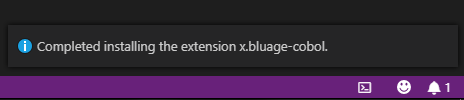
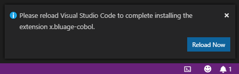
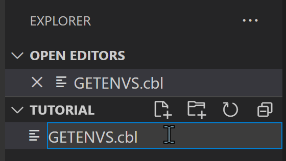
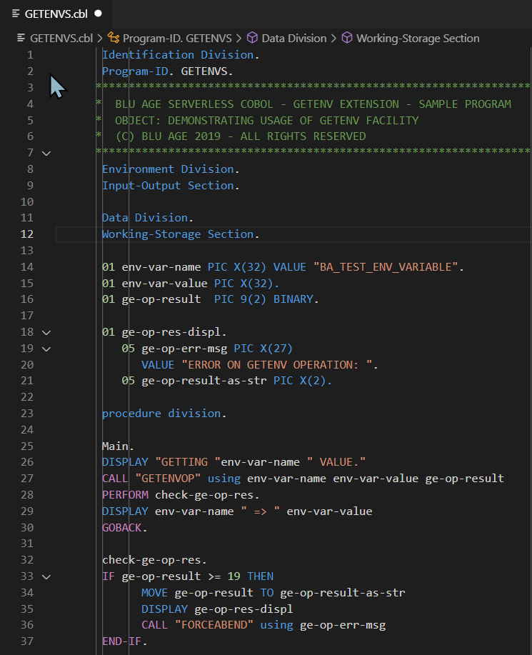
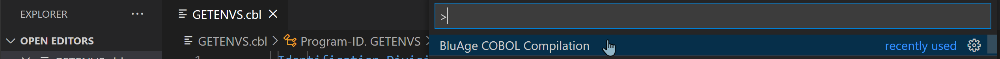
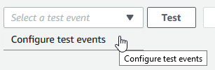

# BluAge ServerLess COBOL - VSCode compiler for Serverless COBOL - User guide

rev. 1.0.4 - (c) BluAge 2019 - All rights reserved.

Compiling COBOL to be deployed on a serverless environment, typically AWS lambda functions, required making calls to a REST call in the early days (autumn 2018). We had in mind to propose a more user-friendly experience than having to deal with curl commands or postman calls.

During Q1 2019, we chose [Visual Studio Code](https://code.visualstudio.com/) (aka VSCode) as the target IDE and developped a dedicated COBOL compilation plugin, including syntax checking and validation.

This plugin does **NOT** take in charge the **syntax coloring of COBOL** sources as quite a few already existing plugins handle that task gracefully (just type COBOL in the extensions MARKETPLACE search box of VSCode to find out and make your choice).

This plugin will:

* **validate the syntax of the cobol** sources, relying on a COBOL 85 base;
* if validation is successfull, pack the content of the current working folder (COBOL sources and COPYBOOKS) and send it for **compilation** to the configured COBOL compilation server (see [setup](#setup) for server address configuration details).
  
   Possible outcomes:

  * Upon successful compilation completion, a valid java artifact (either jar or war, depending on chosen compilation command) will be returned by the compiler to VSCode and stored in a target sub-folder (created if needed -- see [setup](#setup) for configuration details of the target sub-folder name --) of the current working folder.
  * Should compilation issues arise, the compiler will send an archive with error details that will be exposed by the plugin into entries in the PROBLEMS view. No jar nor war is sent back to VSCode if compilation errors were found.
  * Use a dedicated log entry in the OUTPUT view, named 'BluAge Console' to log details about the compilation process;  

## Installing the plugin

  We advise to use the latest VSCode version; this plugin was tested with versions >= 1.30 and **compatibility with older versions is not guaranteed**.

  So far, the plugin is **NOT** available on the VSCode Extensions MARKETPLACE but delivered to selected customers only. To get a copy of the plugin, please apply on this [page](https://www.bluage.com/products/serverless-cobol).

  The plugin will be provided as a vsix file, named **bluage-cobol-X.X.X.vsix** where X.X.X represent the plugin version number.

  To install it, show the EXTENSIONS view --  --

  then, using the menu, pick the 'Install from VSIX...' entry

  

Pick the **bluage-cobol-X.X.X.vsix** from the location where you stored it and click on the Install button.

Check that the VSIX install notification properly shows up:

  

&#x26A0; If upgrading from a previous version of the plugin, the notification message might be different:

   

In that case, click the 'Reload Now' button to ensure the plugin is properly installed.

## Setup

Prior to using the plugin, some quick configuration must be achieved: from the 'Manage' menu, pick the 'Settings' menu entry

  

In the 'Extensions' part of the settings, look for the **BluAge COBOL** entry:

  

We suggest that the configuration must be done at the **User** level and let the **Workspace** level inherit from it.

Configuring the plugin:

* Fill the 'compiler connection' text box with the connection url provided to you by the BluAge support services;
* You can adjust the name of the sub-folder that will contain the produced compilation artifact to your needs; the result sub-folder is named 'bin' by default;
* You can select whether you want verbose or minimal log output for the compilation process; we kindly suggest to keep it to Verbose by default;

  

The location of the server may vary from a customer to another: the BluAge support services will provide a connection url close to your location, to keep network latency as low as possible.

Depending on network conditions, and the size of the uploaded COBOL code, you might need to increase the value of the ```Timeout``` setting, on seldom occasions (facing a HTTP 504 response).

Default value is 300000 ms (5 minutes).

&#x26A0; Depending on your network configuration, you might need to make some additional setup for proper proxy configuration. Please ask to your local network administrator for required configuration details.

## Compiling your COBOL

The BluAge COBOL compiler is designed to compile the content of a main folder that may contain COBOL sources, COPYBOOKS, BMS Maps and sub-folders.

The whole folder content will be zipped and sent to the compiler service that will return an archive, either containing a jar or war (that will be copied automatically by the plugin in a 'bin' sub-folder, so we strongly advise avoiding that name for your own sub-folders) or a json with encountered issues during the compilation process (that will translated by the plugin into entries in the PROBLEMS view of VSCode).

Once you're ready to get your code compiled, **please make sure that the current edited document is a COBOL program**. If the current edited document is not a COBOL program, the compilation process will quickly abort with a message that will be similar to the one below:

```log
BluAge Console
______________________________________________
*** Compilation command called ***
[24-06-2019 10:38:34] ERROR - File to parse is not cobol : mydoc.md.
[24-06-2019 10:38:34] Parsing failed.
*** Compilation command ended ***
______________________________________________
```

Launch the compiling process by pressing [ Ctrl + Shift + p ], to rise the command menu up, then type 'BluAge COBOL compilation' (just type the first letters and let the autocomplete work for you...), then Enter.

NB: Actually two compilations command exist:

* **BluAge COBOL Compilation**: to be used to compile either a batch program or the backend of an online CICS program; Normally, the returned artifact will be a **jar**, that can be used as code of a Lambda function.
* **BluAge COBOL Compilation (Frontend)**: to be used to compile the frontend of an online CICS program. The folder **must** contain the BMS maps representing the application screens. Normally, the returned artifact will be a **war**, that can be deployed on a web server (the war only contains [Angular](https://angular.io/) artifacts).

First of all, the plugin will check the syntax of the COBOL sources in the folder and will raise any error it may encounter. If at least one error is logged, the compilation process won't be launched and problems will be shown in the VSCode PROBLEMS view and in the source code editor:

  

&#x26A0; Early encountered parsing failures in the code might hide other errors located further on. **Fixing the COBOL syntax errors is an iterative process** that might require several rounds.

Once all errors have been corrected, launching the compilation process will actually send the local code to the compilation server for the compilation from COBOL to java to be effectively achieved.

In the OUTPUT view, the 'BluAge Console' will be displaying the compilation logs that should look like to the print below (*server address has been hidden*)

```log
BluAge Console
______________________________________________
*** Compilation command called ***
[24-06-2019 10:43:20] Code validation.
[24-06-2019 10:43:20] Headless compilation launched.
[24-06-2019 10:43:20] Temporary directory created.
[24-06-2019 10:43:20] The workspace directory was packed (728 total bytes).
[24-06-2019 10:43:20] Server path is: http://<hidden server address>/compile.
[24-06-2019 10:43:20] Archive packaged and ready to be sent.
[24-06-2019 10:43:20] Directory created to receive server data.
[24-06-2019 10:43:20] Connection with the compilation server...
[24-06-2019 10:43:33] HTTP Response: 200 OK.
[24-06-2019 10:43:33] Reception of server response.
[24-06-2019 10:43:33] File decompressed.
[24-06-2019 10:43:33] getvenv-sample-service-1.0.0.jar moved to result directory.
[24-06-2019 10:43:33] Compilation succeeded!
*** Compilation command ended ***
______________________________________________
```

If compilation went fine, the HTTP response code will be 200.
The resulting jar appears in the configured target sub-folder:


Any other response code (4XX, 5XX) indicate something went wrong during the compilation process.

Shoud compilation issues be raised, please check the entries in the PROBLEMS view to be able to fix the COBOL code accordingly. If you feel like some valid COBOL source is not being compiled properly, feel free to file an issue at [BluAge support desk](https://helpdesk.bluage.com) using your provided credentials.

**Important notice:** the resulting jar to be deployed as code of a lambda function requires that the function uses the proper BluAge ServerLess COBOL layer version you have been granted access to, on a given AWS region.

## Quick Tutorial : compile and deploy your first ServerLess COBOL function, in 10 simple steps

### 1. Folder creation

  Create a folder, named "tutorial" for example, on your desktop that will contain the COBOL source to be compiled.

### 2. Folder selection

  Open VSCode (at this stage, we suppose you did perform the installation/setup process of the BluAge COBOL plugin described above), and select the "Open Folder ..." entry , from the "File" menu. Select the "tutorial" folder you created in step 1.

### 3. File creation

  Create a new file, in that folder, named GETENV.cbl:



### 4. File contents editing

  Fill the contents of the editor with the following code:

```{.cobol}
       Identification Division.
       Program-ID. GETENV.
      ******************************************************************
      *  BLU AGE SERVERLESS COBOL - GETENV EXTENSION - SAMPLE PROGRAM
      *  OBJECT: DEMONSTRATING USAGE OF GETENV FACILITY
      *  (C) BLU AGE 2019 - ALL RIGHTS RESERVED
      ******************************************************************  
       Environment Division.
       Input-Output Section.

       Data Division.
       Working-Storage Section.

       01 env-var-name PIC X(32) VALUE "BA_TEST_ENV_VARIABLE".
       01 env-var-value PIC X(32).
       01 ge-op-result  PIC 9(2) BINARY.

       01 ge-op-res-displ.
          05 ge-op-err-msg PIC X(27)
             VALUE "ERROR ON GETENV OPERATION: ".
          05 ge-op-result-as-str PIC X(2).

       procedure division.

       Main.
       DISPLAY "GETTING "env-var-name " VALUE."
       CALL "GETENVOP" using env-var-name env-var-value ge-op-result
       PERFORM check-ge-op-res.
       DISPLAY env-var-name " => " env-var-value
       GOBACK.

       check-ge-op-res.
       IF ge-op-result >= 19 THEN
             MOVE ge-op-result TO ge-op-result-as-str
             DISPLAY ge-op-res-displ
             CALL "FORCEABEND" using ge-op-err-msg
       END-IF.

```



Notice the white circle near the file name, indicating that the file is unsaved.

### 5.  Save File contents

Save the file contents to disk (Ctrl + S);
Notice that once file has been saved, the white circle is replaced by a cross:


### 6. Compilation

If the OUTPUT tab is not visible, make it visible using (Ctrl + Shift + %), and select it. In the OUTPUT tab, select the BluAge Console entry from the menu:


Launch the compilation process, by using (Ctrl + Shift + P) and selecting 'BluAge COBOL Compilation':



Make sure the compilation succeeded:

```log
BluAge Console
______________________________________________
*** Compilation command called ***
[25-06-2019 11:19:13] Code validation.
[25-06-2019 11:19:13] Headless compilation launched.
[25-06-2019 11:19:13] Temporary directory created.
[25-06-2019 11:19:13] The workspace directory was packed (728 total bytes).
[25-06-2019 11:19:13] Server path is: http://<hidden server address>/compile.
[25-06-2019 11:19:13] Archive packaged and ready to be sent.
[25-06-2019 11:19:13] Directory created to receive server data.
[25-06-2019 11:19:13] Connection with the compilation server...
[25-06-2019 11:19:25] HTTP Response: 200 OK.
[25-06-2019 11:19:25] Reception of server response.
[25-06-2019 11:19:25] File decompressed.
[25-06-2019 11:19:25] tutorial-service-1.0.0.jar moved to result directory.
[25-06-2019 11:19:25] Compilation succeeded!
*** Compilation command ended ***
______________________________________________
```

In the EXPLORER view, the target folder should contain a jar named tutorial-service-1.0.0.jar:


Now that the ServerLess COBOL function code as been compiled, it is time to deploy it.

### 7. Create a new lambda function

  Using the AWS Console, create a new Lambda function in the aws region you've been given permission to use the ServerLess COBOL layer - click on the 'Create function' button:


 Name it 'tutorial' and select 'Java 8' as the Runtime to be used;
 Pick 'Create a new role with basic Lambda permissions' for the Execution role:


Click on the 'Create function' button.

### 8. Lambda function: setting the BluAge ServerLess COBOL layer

  On the function editing page, click on the Layer zone to make the Layer management zone visible:


Click on the "Add a layer" button. A new page will appear. Select the option "Provide a layer version ARN". In the Layer version ARN textbox, paste the layer version ARN you have been granted use permission.


&#x26A0; Depending on region, the version number and/or layer name may vary. The value on the screenshot above is just for illustration purpose, please use the version ARN provided by the BluAge helpdesk team.

Click on the 'Add' button to get back to the main lambda function UI page.

### 9. Lambda function settings

The main page exhibits an 'Unsaved changes' situation (and the layer counter value is now 1)


Since more settings need to be done, there's no need to save things right now.
Click on the function name, to make the standard Configuration visible again.
  
#### 9.1. Upload function code jar


Click on the 'Upload' button.
In the opening filepicker, select the 'tutorial-service-1.0.0.jar' file and click on the 'Open' button (on this french screenshot, the 'Open' button is labelled 'Ouvrir').


The jar file now appears as selected:


#### 9.2. Set proper Handler

In the Handler textbox, replace the existing default value


by ```com.netfective.bluage.GWLambdaRequestHandler::handleRequest```


#### 9.3. Set environment variables

The first mandatory environment variable to be set is the one that permits to specify the run unit program entry point (as it may not be obvious, especially when multiple COBOL programs are being compiled together).
The value to be given is the Program-ID of the COBOL program serving as run unit entry point. Here, a single program being present, the value to be set is GETENV

```{.cobol}
       Identification Division.
       Program-ID. GETENV.
```

The name of the environment variable has to be BA_RUN_UNIT_ENTRYPOINT -- and yes, this name is reserved for that purpose --

In addition, another environment variable has to be set, as this tutorial exhibits how to get the value from lambda environment variables from the COBOL code. Looking at the code, we notice the following statements:

```{.cobol}
       Working-Storage Section.

       01 env-var-name PIC X(32) VALUE "BA_TEST_ENV_VARIABLE".
...  
       Main.
       DISPLAY "GETTING "env-var-name " VALUE."
       CALL "GETENVOP" using env-var-name env-var-value ge-op-result

```

Using the GETENVOP facility, the COBOL program wants to get the value of a environment variable, named BA_TEST_ENV_VARIABLE, whose value is expected to be an alphanumeric value, not longer than 32 characters.
We add an environment variable named that way, with the value "ServerLess COBOL Tutorial"


#### 9.4. Set memory limit and execution timeout

Scroll down the page to reach the Basic settings zone. Set the memory consumption to at least 1 GB and the Timeout to 30 seconds.


Now that all settings have been done, Scroll up the page and save all pending changes with the 'Save' button.

&#x26A0; Actual saving may take a few seconds as the effective jar code upload will take place at that time, and the upload time may vary depending on network conditions.

The settings have been saved, as indicated by the corresponding icon:


### 10. Testing the lambda function

In order to be able to test the function, a json test event must be supplied. Since the linkage section of the program is empty, nothing has to be provided in the json event, which must be left empty. For JSON testing, the BluAge ServerLess lambda request handler always expects an array of parameters, so providing an empty JSON array ( ```[]``` ) is fine.

From the test event drop down, select the menu entry 'Configure test events'



A popup will appear. Set the event name to "empty" for example, and set the content of the event to an empty JSON array:


Click on the 'Create' button to get back to the main lambda UI page.
There, click on the 'Test' button.


&#x26A0; First run of a freshly deployed lambda function might take some time (generally, a few seconds), due to the well known 'cold start' effect. After the first run, the lambda function will run significantly faster (check figures below).

Inspect the execution result, to make sure the function executed successfully. The log should contain the following lines (of course timestamps will  be different)

```log
2019-06-25 08:19:38.413  INFO 1 --- [           main] c.n.b.g.g.s.o.GenericGetEnvOperations    : returning env variable [BA_TEST_ENV_VARIABLE]: (ServerLess COBOL Tutorial       )
2019-06-25 08:19:38.415  INFO 1 --- [           main] c.n.b.g.service.impl.GetenvProcessImpl   : BA_TEST_ENV_VARIABLE             => ServerLess COBOL Tutorial
```


Test the function again. You'll notice a much shorter execution time (from a few seconds to a few milliseconds), since we got rid of the the cold start effect.


**Congratulations, you've compiled and deployed your first ServerLess COBOL Lambda function!**

To go further with BluAge ServerLess COBOL, please consult the documentation of the ServerLess COBOL AWS extensions and the sample programs.
